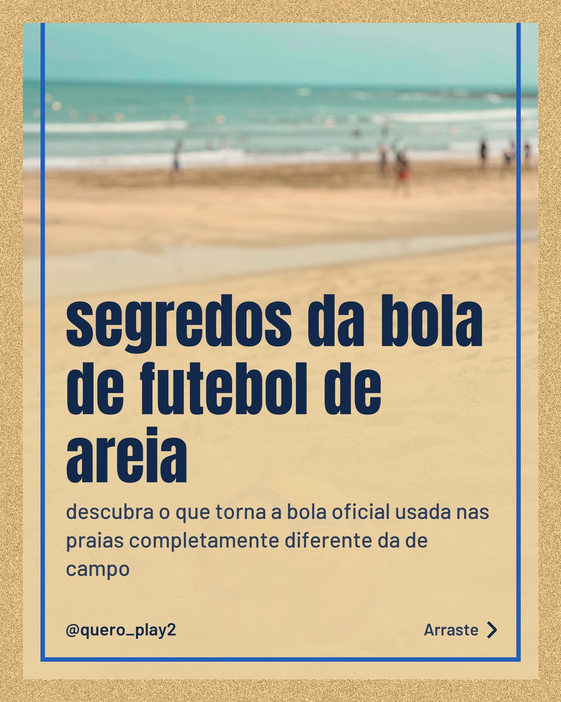
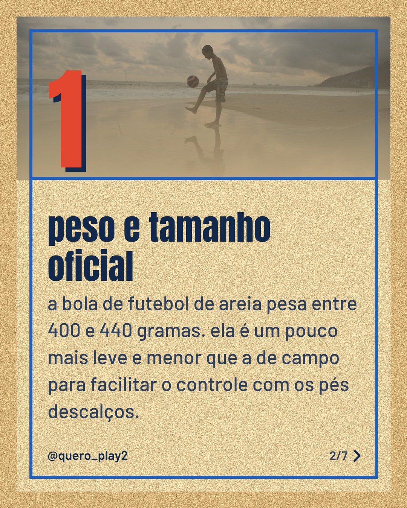
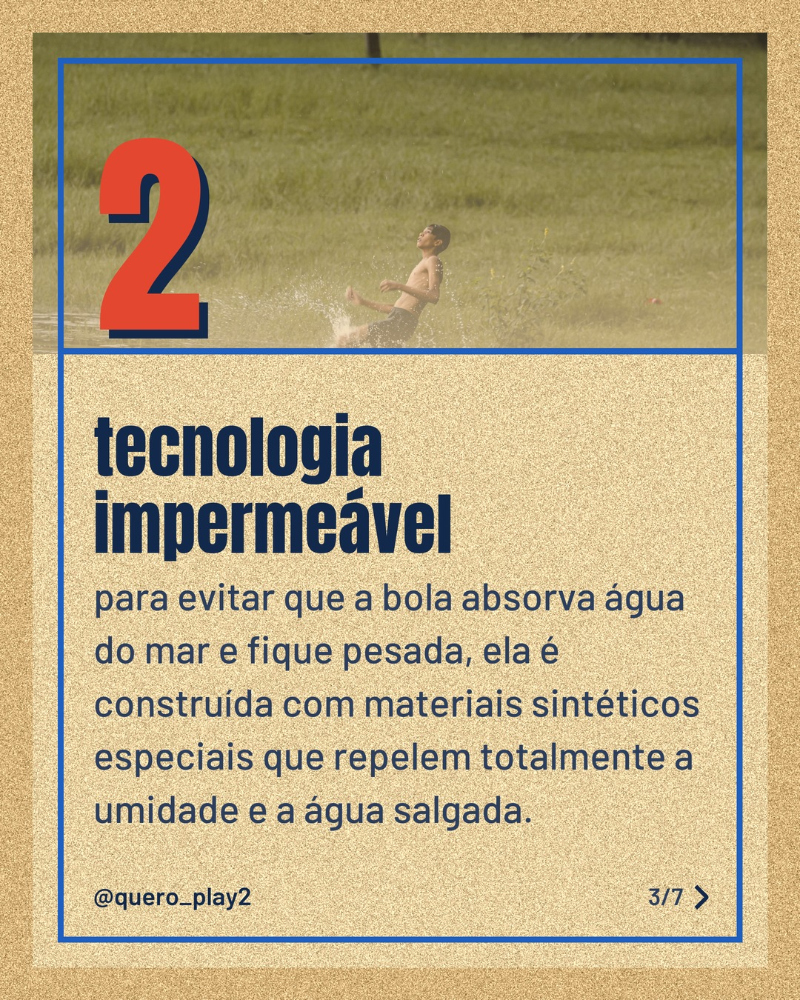
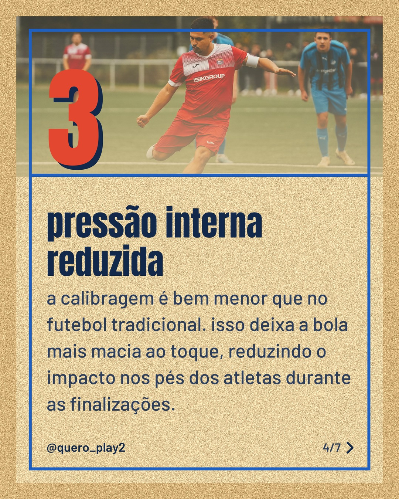
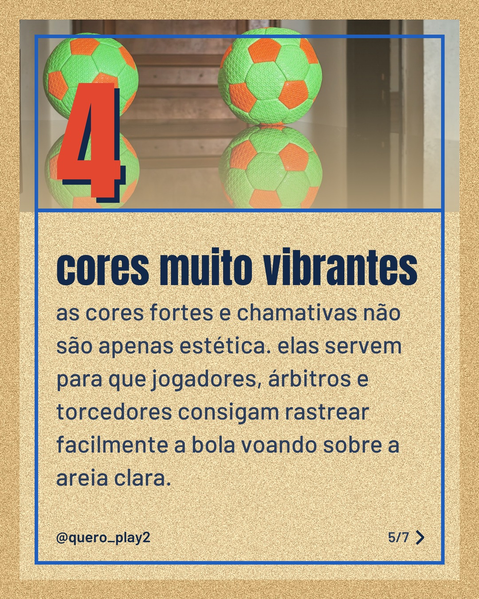
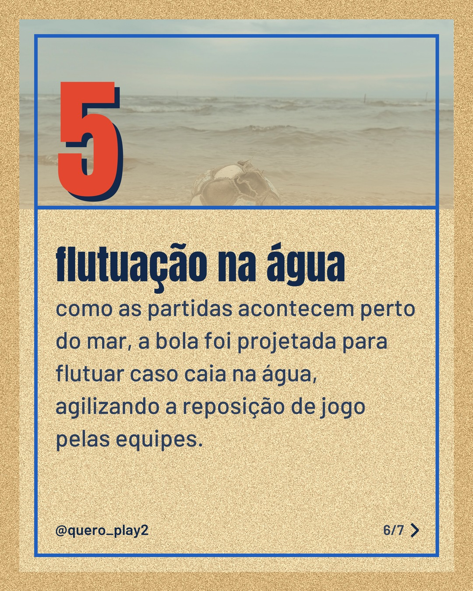
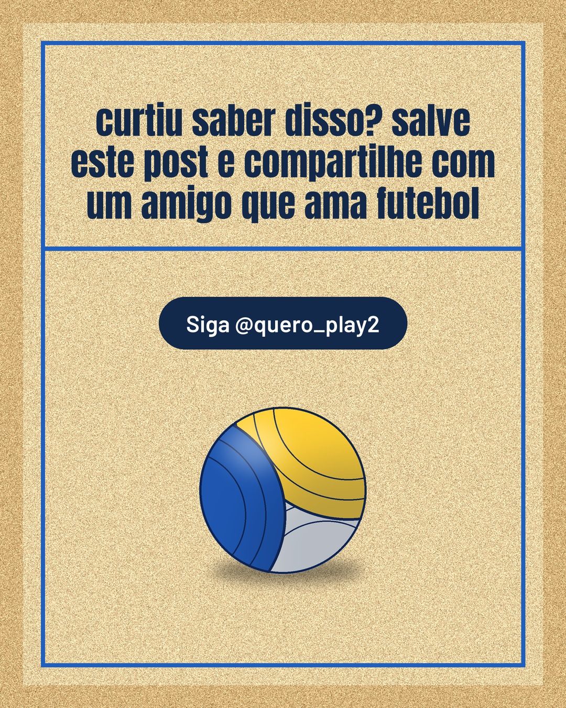

# areia

**Status:** aguardando revisão · 7 slides · gerado com `gemini/gemini-3.5-flash-lite`

      

## Legenda

> Você sabia que a bola de praia passa por um desenvolvimento totalmente diferente daquela que rola nos gramados tradicionais? ⚽️
>
> Tudo nela é pensado para o esporte na areia: desde o peso reduzido até a tecnologia que impede que ela encharque na beira do mar. É um equipamento feito sob medida para o espetáculo nas praias!
>
> Arraste pro lado para entender cada detalhe exclusivo e me conta nos comentários: você imaginava que a pressão dela era tão diferente assim? 👇
>
> 📷 Fotos: Ayoub El kaouani, Fabio Teixeira, Renjith Tomy Pkm, Omar Ramadan, Mahmoud Zakariya e bahar 𓆰 (Pexels)
>
> #futeboldeareia #beachsoccer #curiosidades #futebol #esportesnaareia #futebolecia #praia #atletas #dicasdefutebol

---
**Quer mudar algo?** Edite o `legenda.txt` para trocar a legenda, ou o `post.json` para trocar os textos dos slides (depois rode `python main.py redesenhar 2026-09-26_232122`).
Foto não combinou? `python main.py trocar-foto 2026-09-26_232122 N` (0 = capa, 1, 2... = slides).
Para descartar este post, apague esta pasta.
