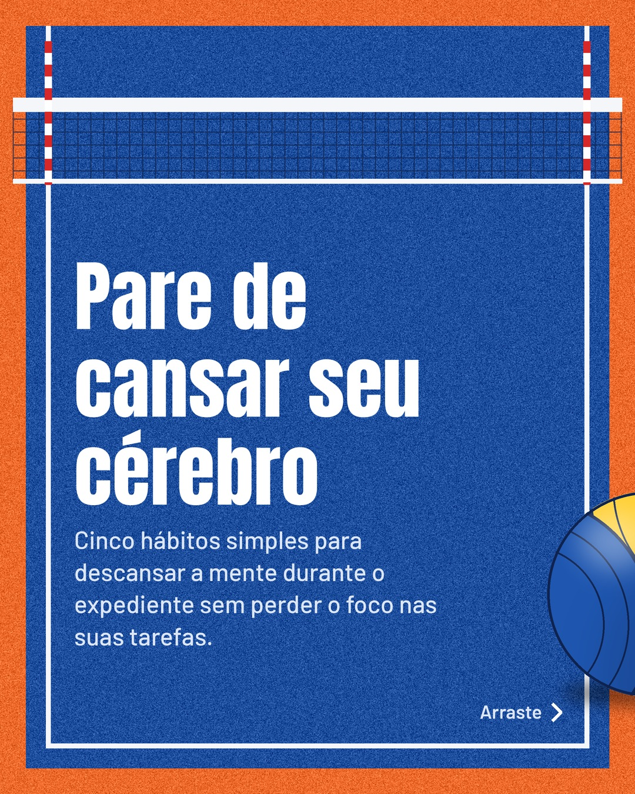
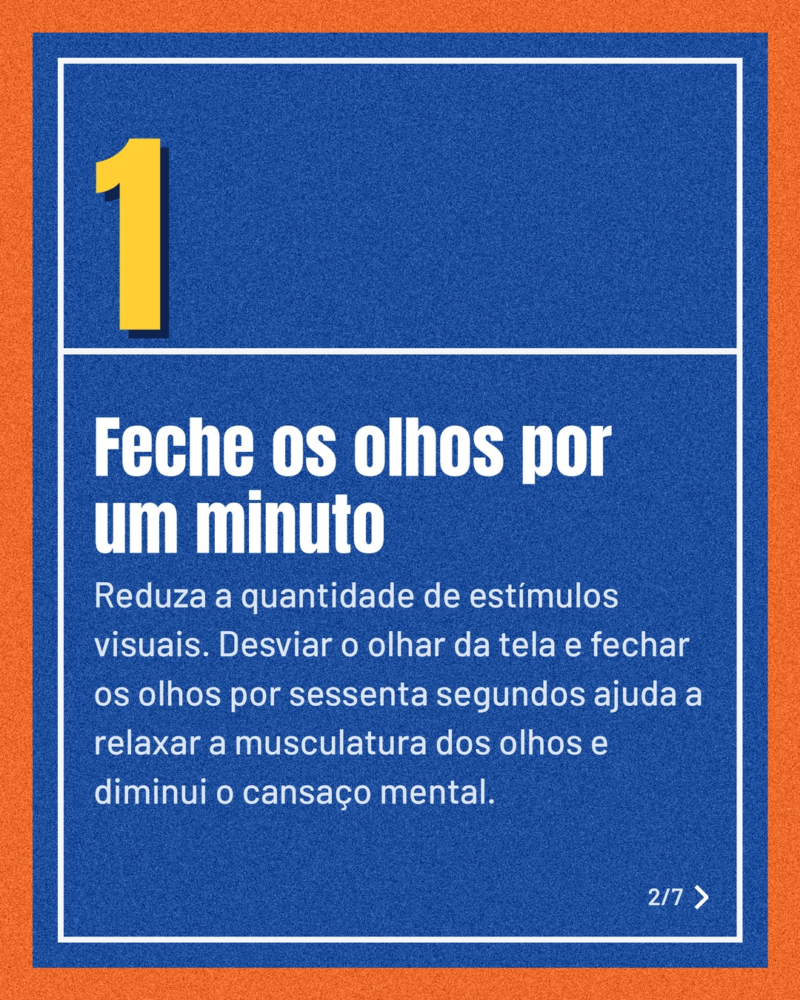
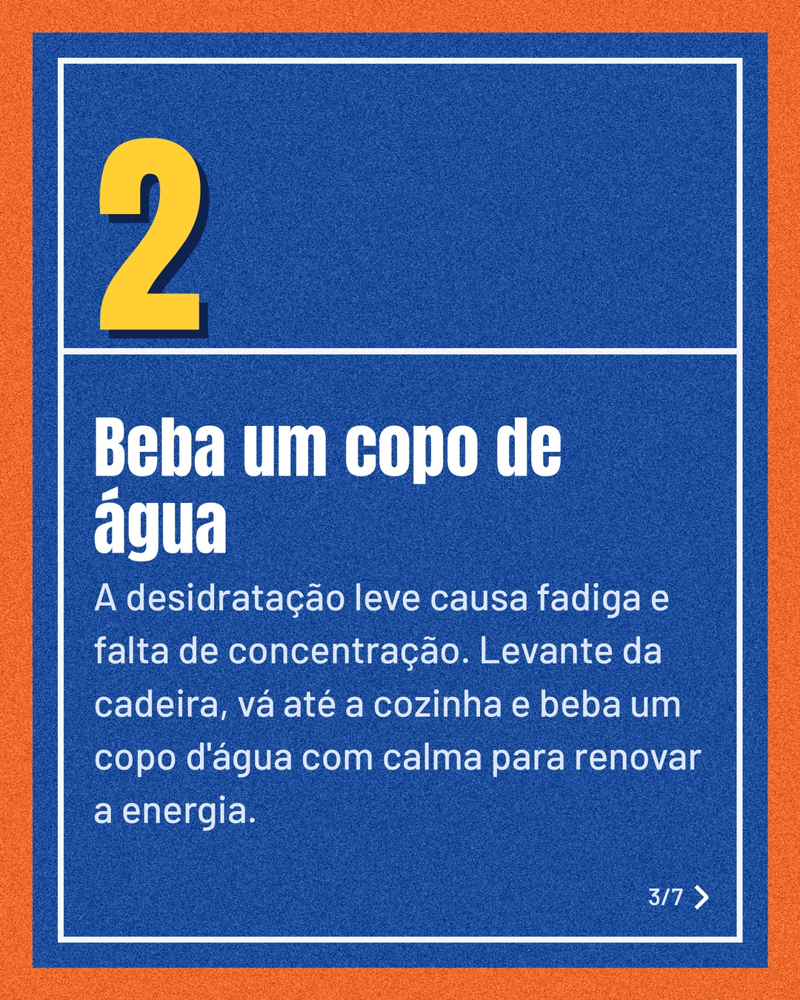
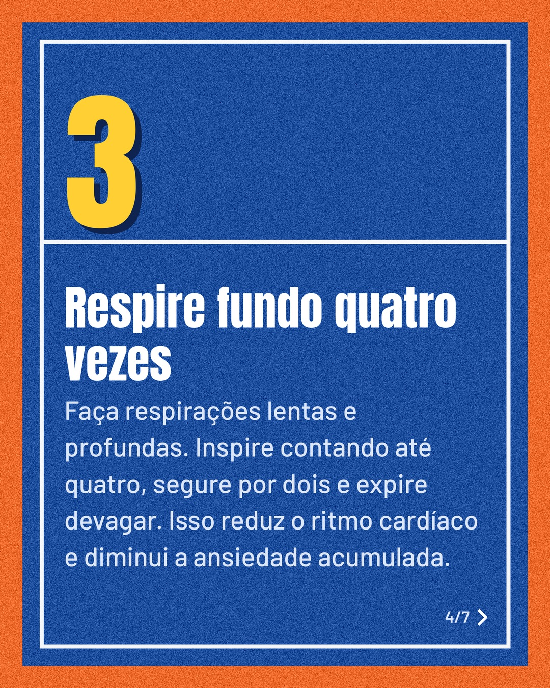
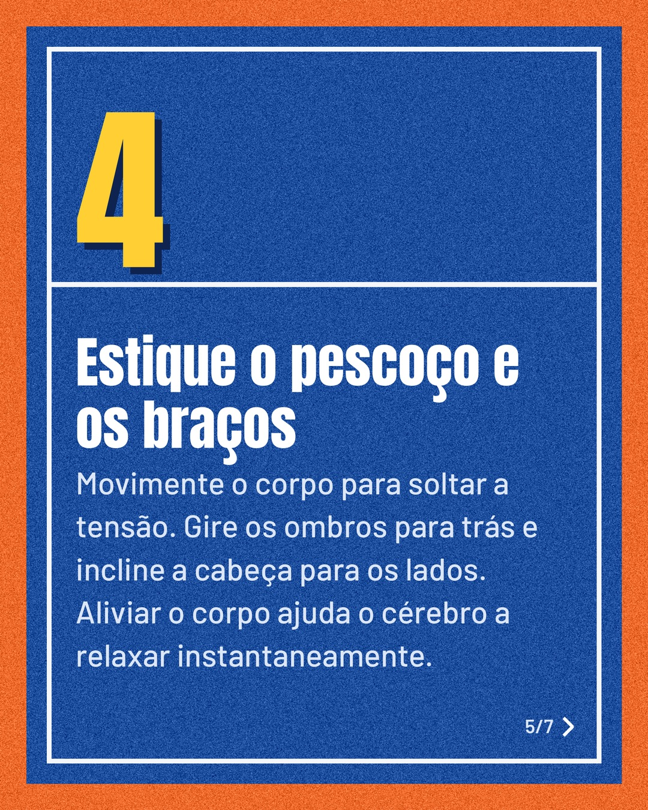
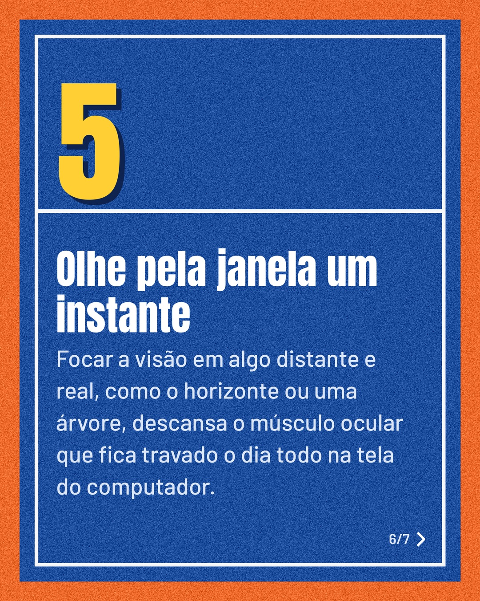
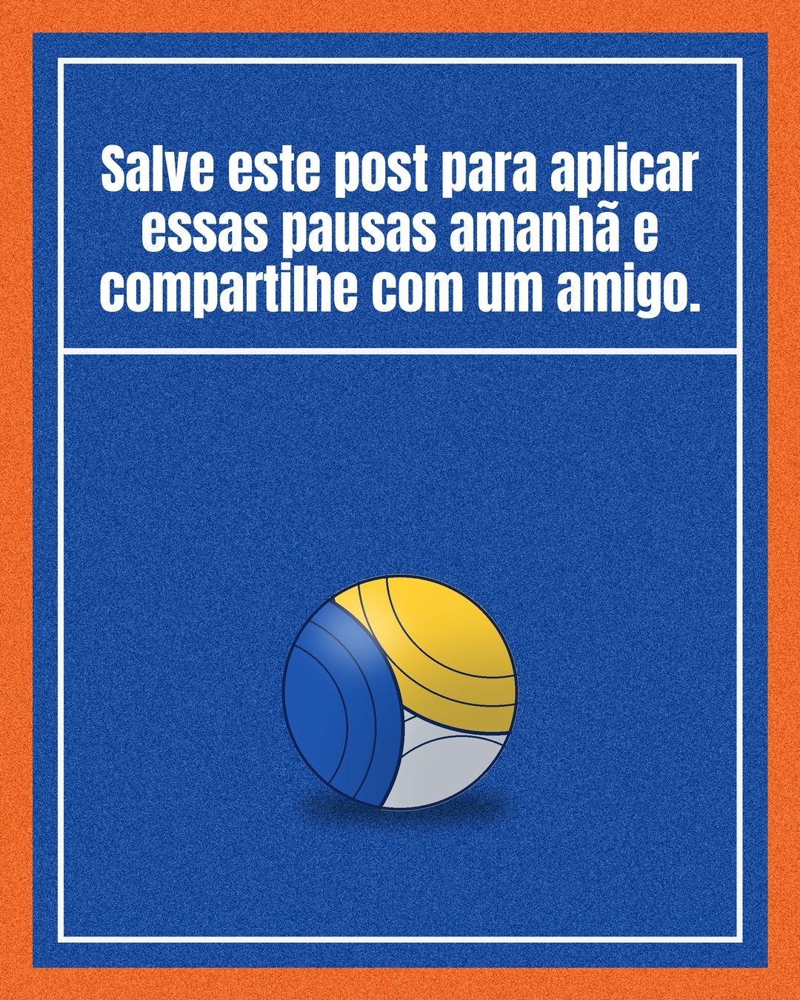

# quadra

**Status:** aguardando revisão · 7 slides · gerado com `gemini/gemini-3.5-flash-lite`

      

## Legenda

> Você sente que a energia acaba muito antes do fim do expediente? Muitas vezes o problema não é o volume de trabalho, mas a falta de descanso real entre as tarefas.
>
> Fazer pequenas pausas ao longo do dia ajuda a manter o foco alto e evita aquela exaustão no final da tarde. Deslize para o lado para ver cinco hábitos fáceis de aplicar agora mesmo.
>
> Qual dessas pausas você vai testar hoje? Deixe nos comentários!
>
> #produtividade #bemestar #saudemental #pausaparaocafe #foco #rotina #trabalhorendimento #descanso #vidasaudavel

---
**Quer mudar algo?** Edite o `legenda.txt` para trocar a legenda, ou o `post.json` para trocar os textos dos slides (depois rode `python main.py redesenhar 2026-09-27_134333`).
Foto não combinou? `python main.py trocar-foto 2026-09-27_134333 N` (0 = capa, 1, 2... = slides).
Para descartar este post, apague esta pasta.
