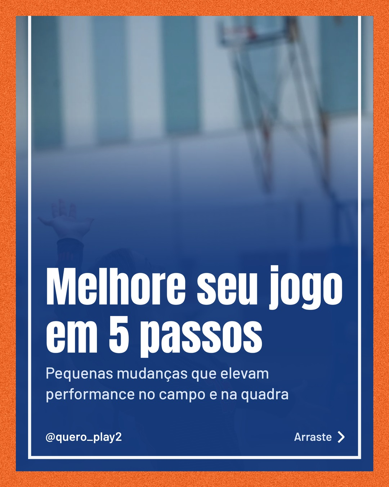
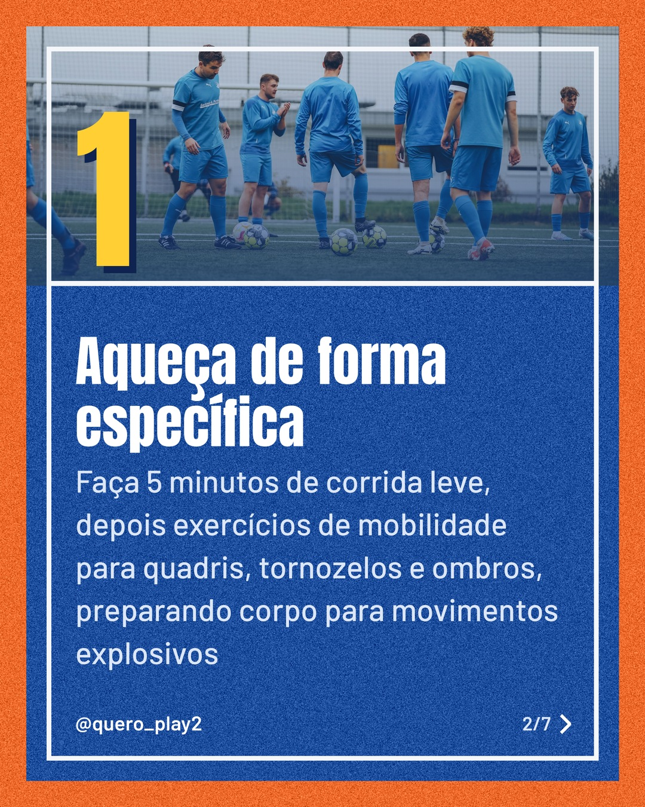
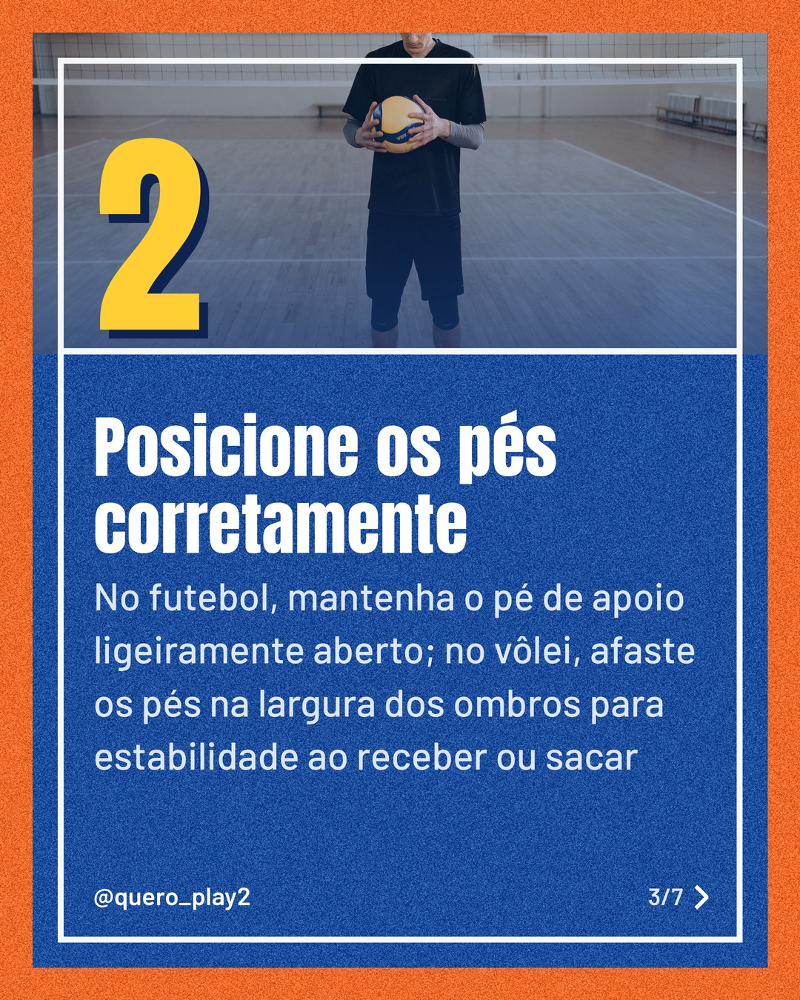
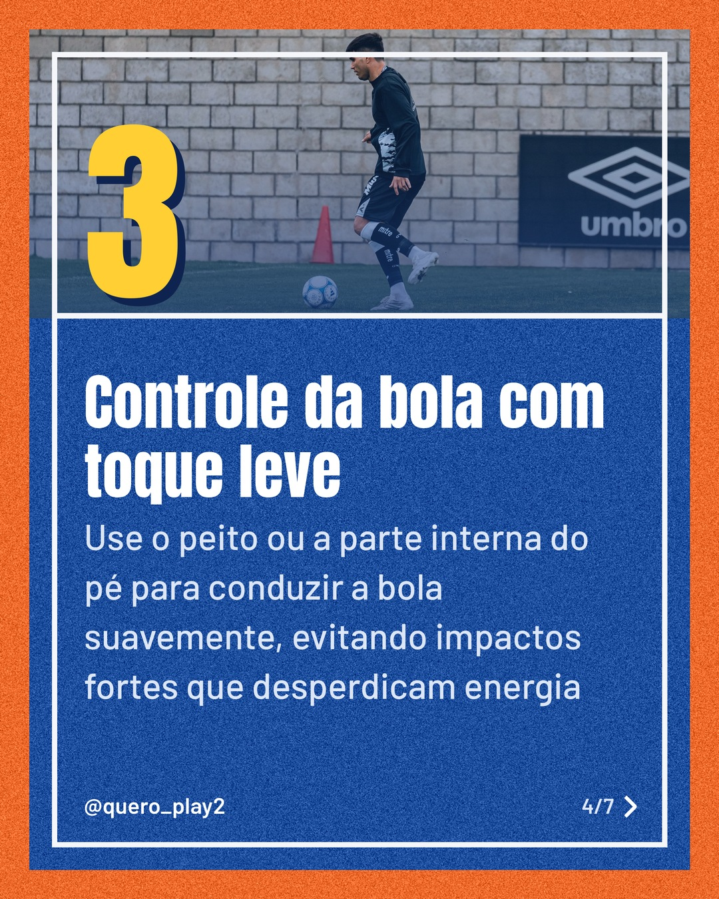
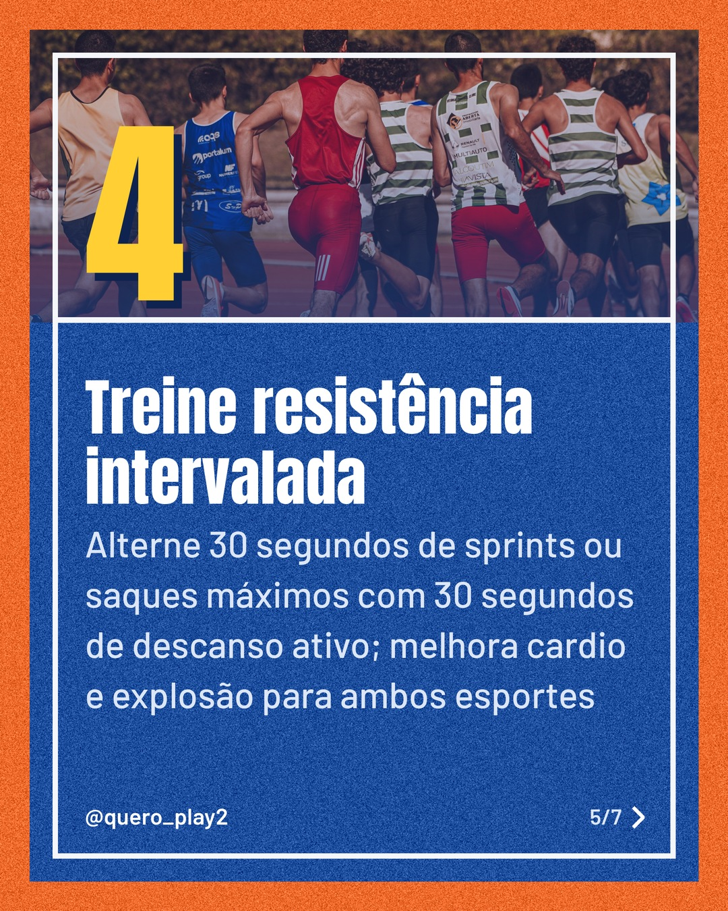
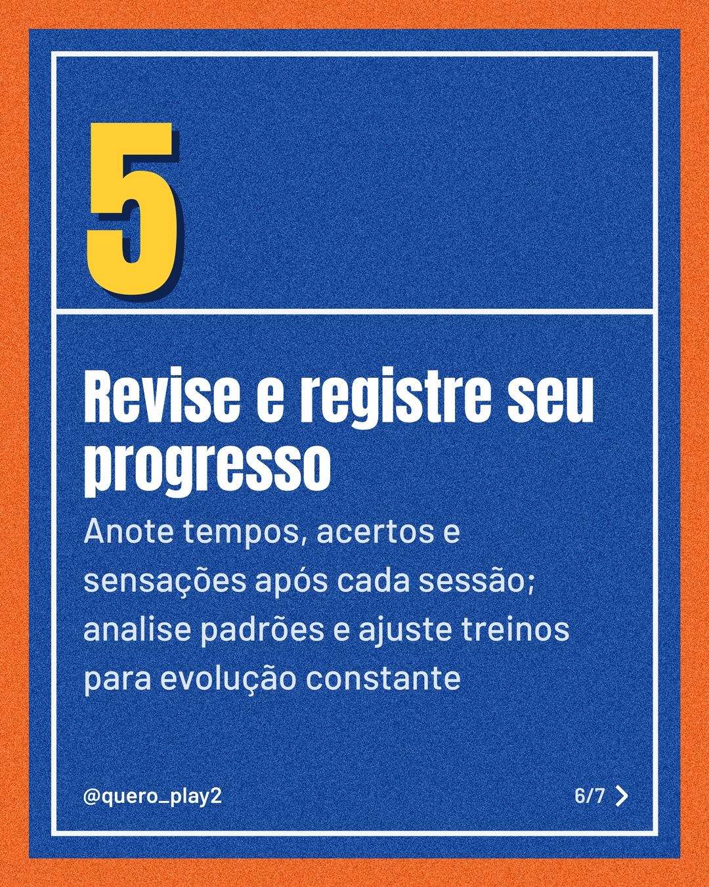
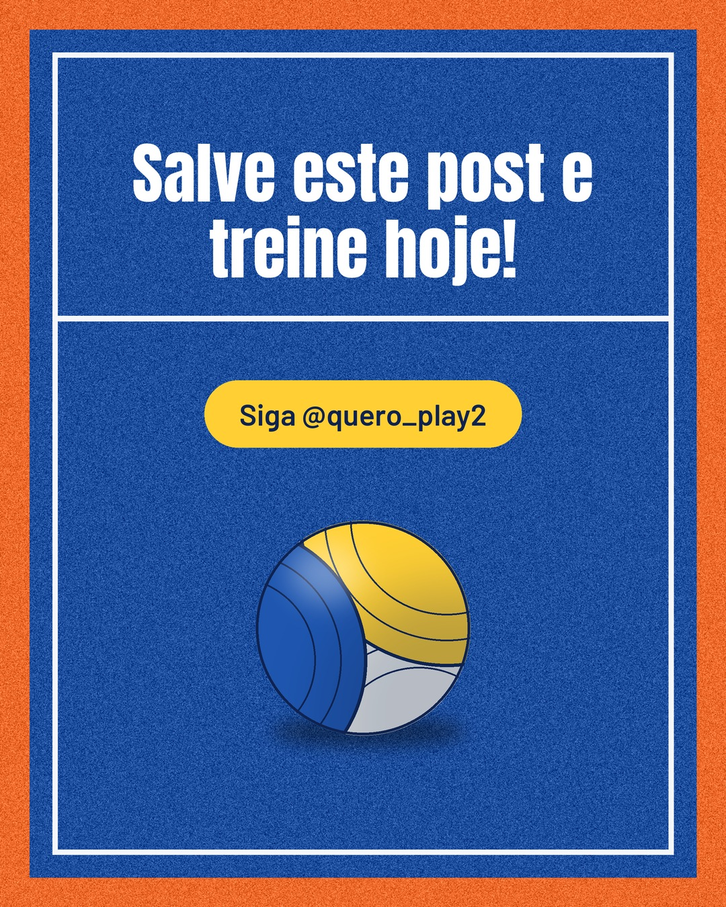

# quadra

**Status:** aguardando revisão · 7 slides · gerado com `groq/openai/gpt-oss-120b`

      

## Legenda

> Quer levar seu futebol e vôlei ao próximo nível? 🚀 Descubra cinco passos simples que vão transformar seus treinos.
>
> Do aquecimento ao registro, cada dica foi pensada para quem treina de verdade. 📋 Não perca nenhum detalhe, deslize para o lado e veja!
>
> Curtiu? Marca aquele amigo que precisa melhorar e comenta qual passo você vai aplicar primeiro. 👊 Não esqueça de seguir para mais curiosidades e dicas!
>
> 📷 Fotos: Tom Fisk, Omar Ramadan, Pavel Danilyuk, Franco Monsalvo e RUN 4 FFWPU (Pexels)
>
> #futebol #volei #dicasesporte #treinamento #performance #esportes #futebolbrasil #voleiBrasil #treinoeficaz #esporteparatodos #motivacao #melhoria

---
**Quer mudar algo?** Edite o `legenda.txt` para trocar a legenda, ou o `post.json` para trocar os textos dos slides (depois rode `python main.py redesenhar 2026-09-28_084315`).
Foto não combinou? `python main.py trocar-foto 2026-09-28_084315 N` (0 = capa, 1, 2... = slides).
Para descartar este post, apague esta pasta.
