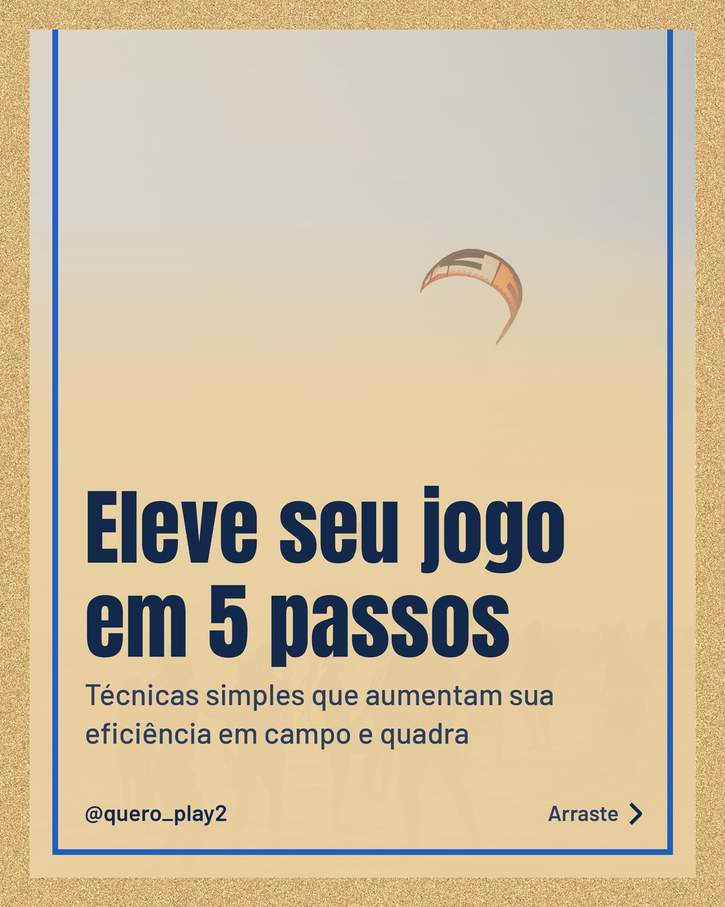
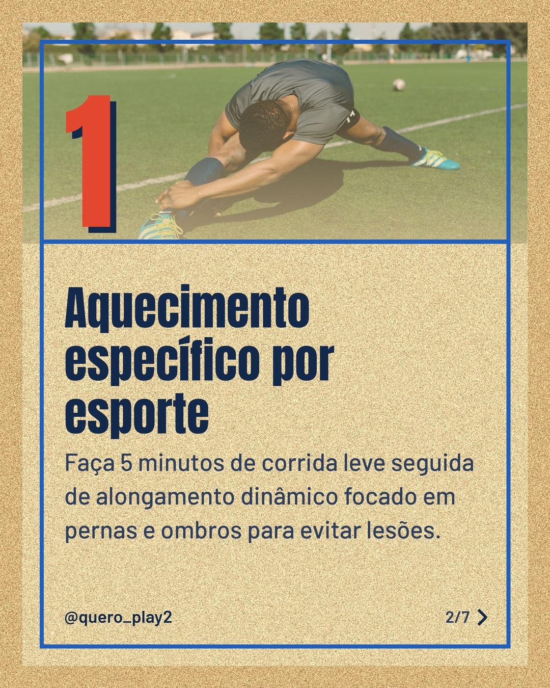
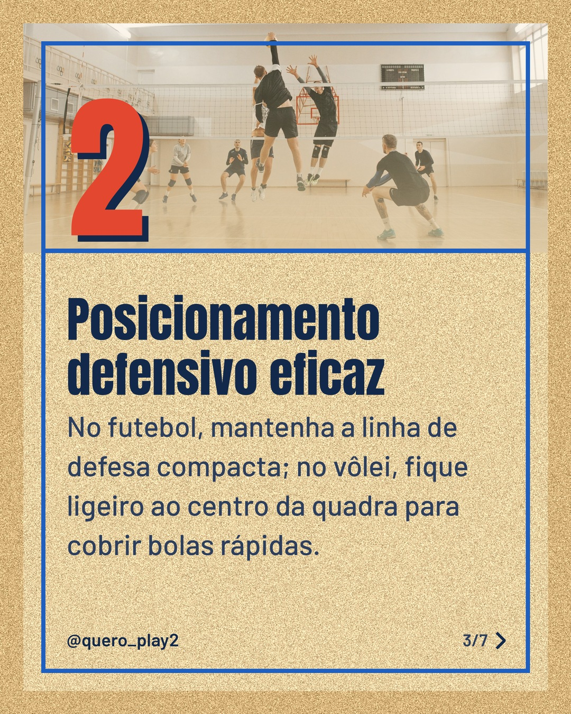
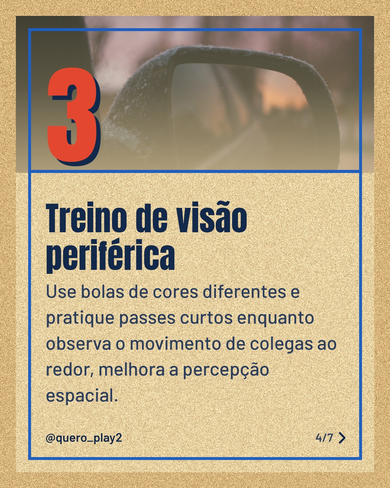
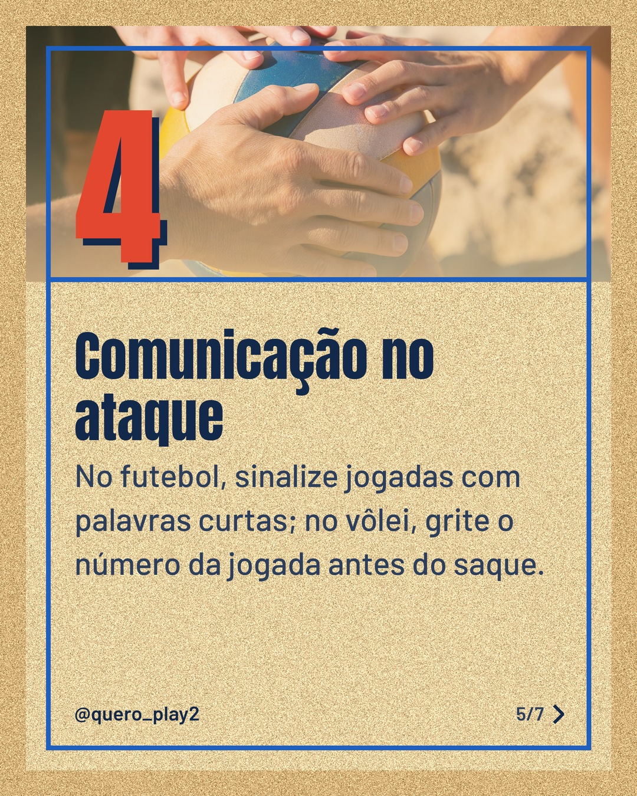
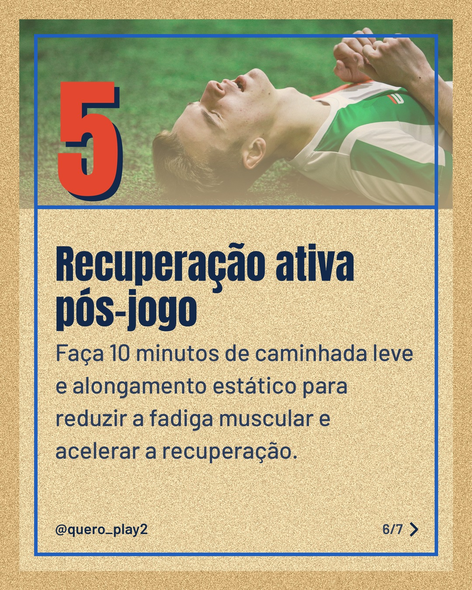
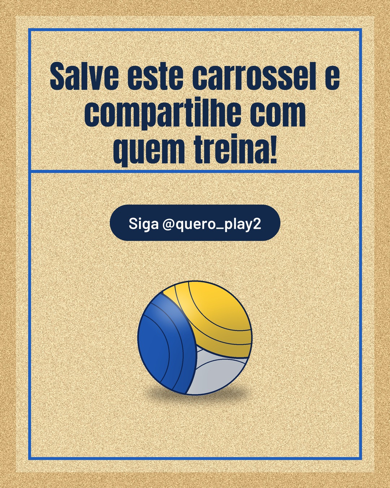

# areia

**Status:** aguardando revisão · 7 slides · gerado com `groq/openai/gpt-oss-120b`

      

## Legenda

> Quer melhorar seu desempenho tanto no futebol quanto no vôlei? 🙌 Descubra 5 dicas práticas que vão transformar seus treinos.
> Deslize para a direita 👉 e veja cada passo detalhado. Salve, marque um amigo e conte nos comentários qual dica você vai aplicar primeiro! ⚽🏐
>
> 📷 Fotos: Luiz Fernando, RDNE Stock project, Pavel Danilyuk, Alesia Talkachova, Kampus Production e Misha Zimin (Pexels)
>
> #futebol #volei #performance #treinamento #dicasdeesporte #esportelife #jogadores #saudeesportiva #tacticas #motivacao

---
**Quer mudar algo?** Edite o `legenda.txt` para trocar a legenda, ou o `post.json` para trocar os textos dos slides (depois rode `python main.py redesenhar 2026-09-29_145501`).
Foto não combinou? `python main.py trocar-foto 2026-09-29_145501 N` (0 = capa, 1, 2... = slides).
Para descartar este post, apague esta pasta.
