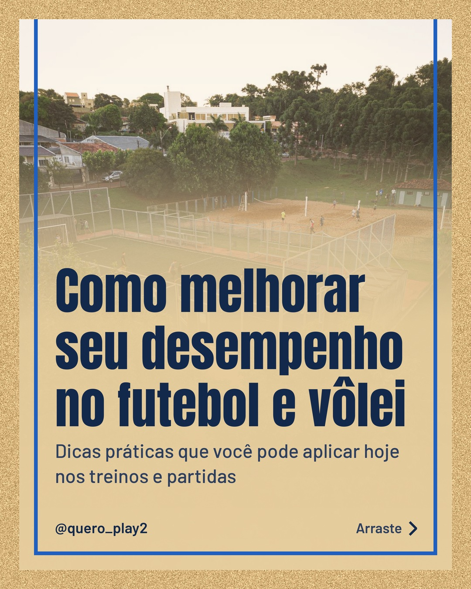
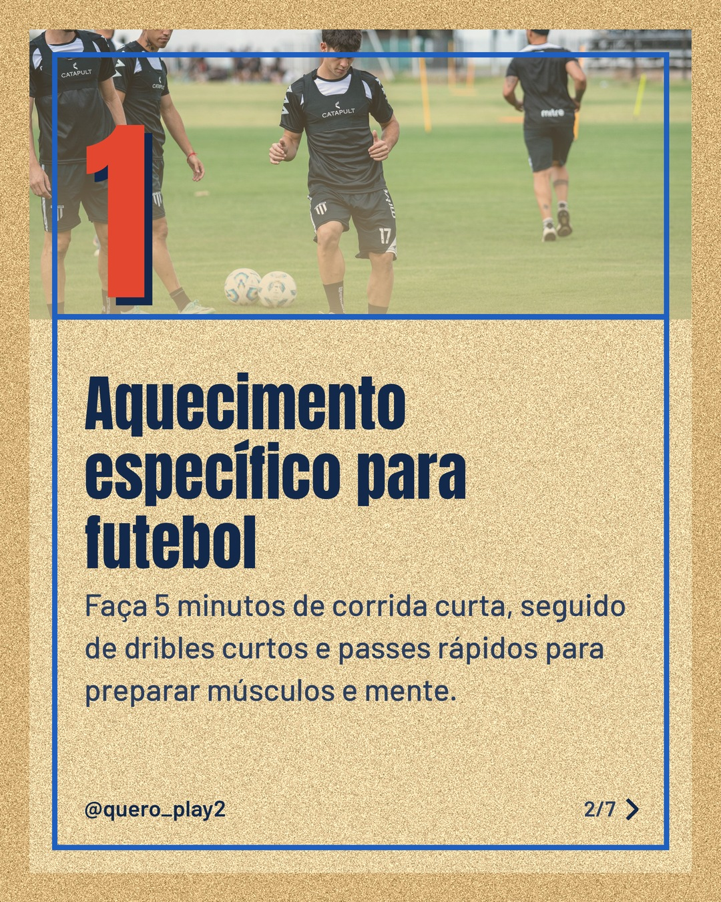
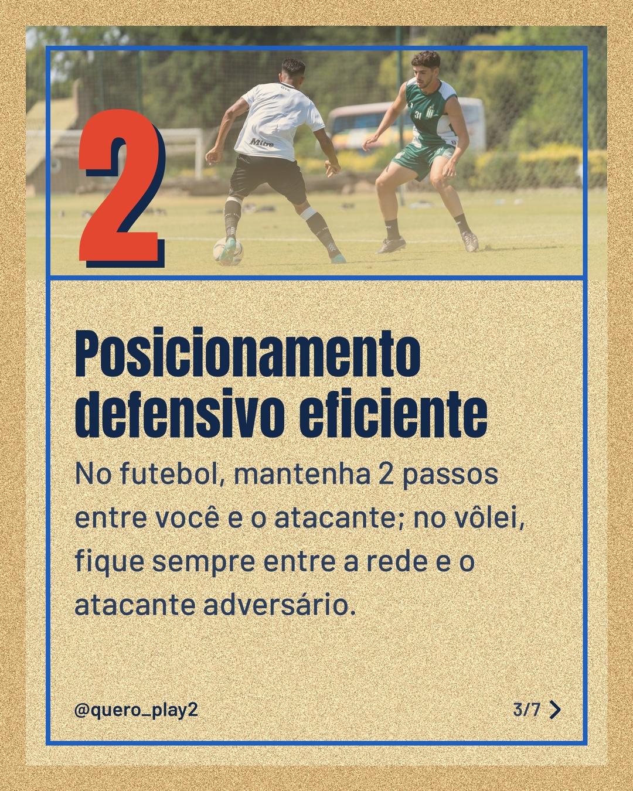
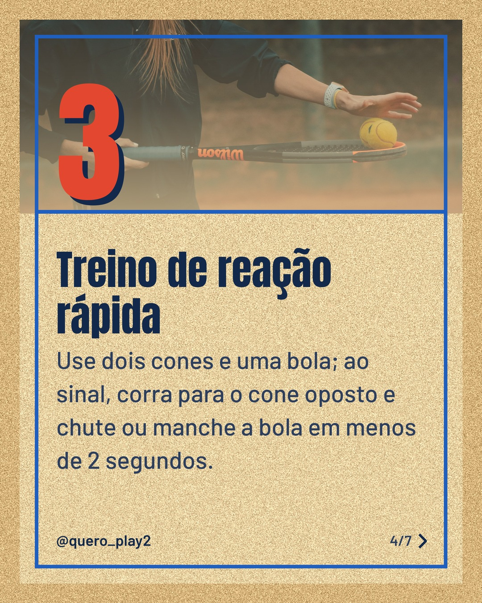
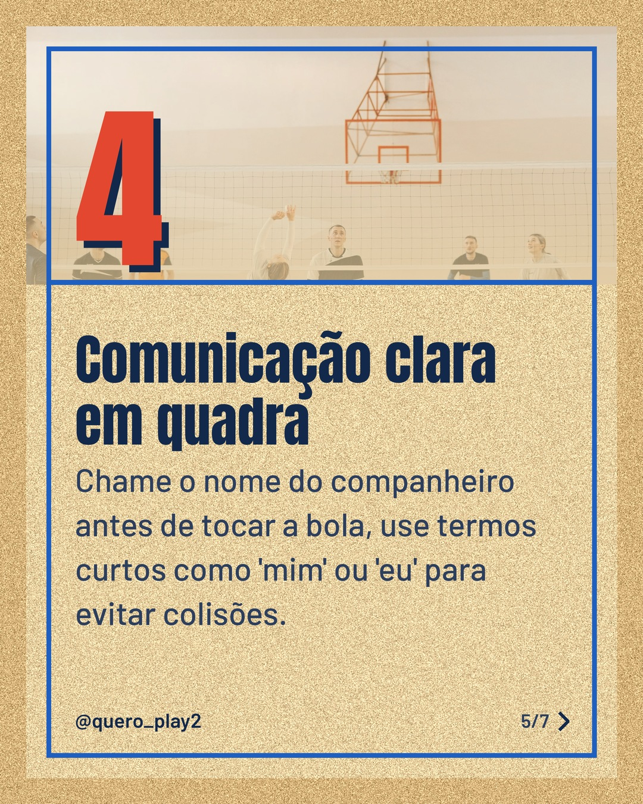
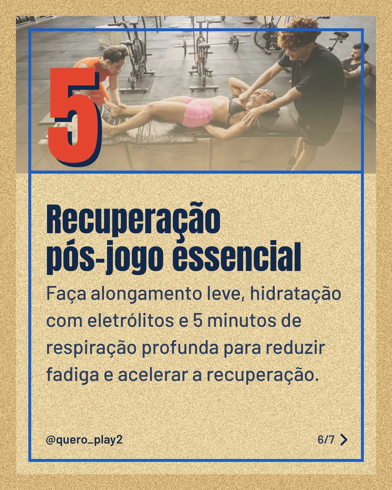

# areia

**Status:** aguardando revisão · 7 slides · gerado com `groq/openai/gpt-oss-120b`

      

## Legenda

> Quer subir de nível no futebol ou no vôlei? 🚀 Cada dica aqui foi pensada para ser prática e fácil de aplicar nos treinos.
>
> Deslize para o lado e descubra o que fazer antes, durante e depois das partidas. 👟⚽🏐
>
> Curtiu? Deixe um comentário, siga o perfil e salve para consultar sempre que precisar! 👍
>
> 📷 Fotos: Guilherme Stecanella, Franco Monsalvo, Gaspar Zaldo, Pavel Danilyuk e Jonathan Borba (Pexels)
>
> #curiosidadesfutebol #curiosidadesvolei #futeboldicas #volei #dicas #treino #esportes #brasil #futebolvolei #performance

---
**Quer mudar algo?** Edite o `legenda.txt` para trocar a legenda, ou o `post.json` para trocar os textos dos slides (depois rode `python main.py redesenhar 2026-10-01_151622`).
Foto não combinou? `python main.py trocar-foto 2026-10-01_151622 N` (0 = capa, 1, 2... = slides).
Para descartar este post, apague esta pasta.
