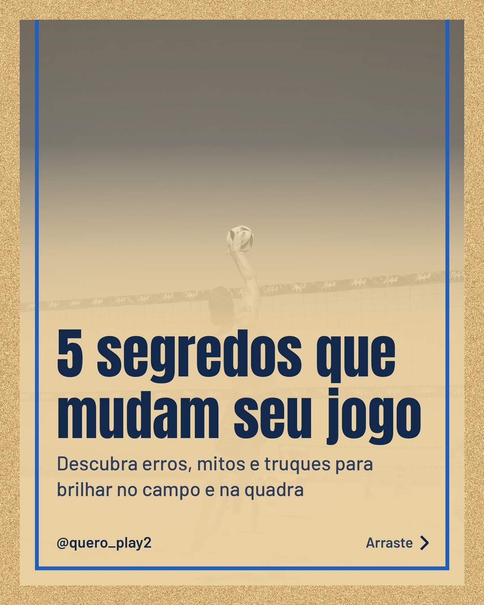
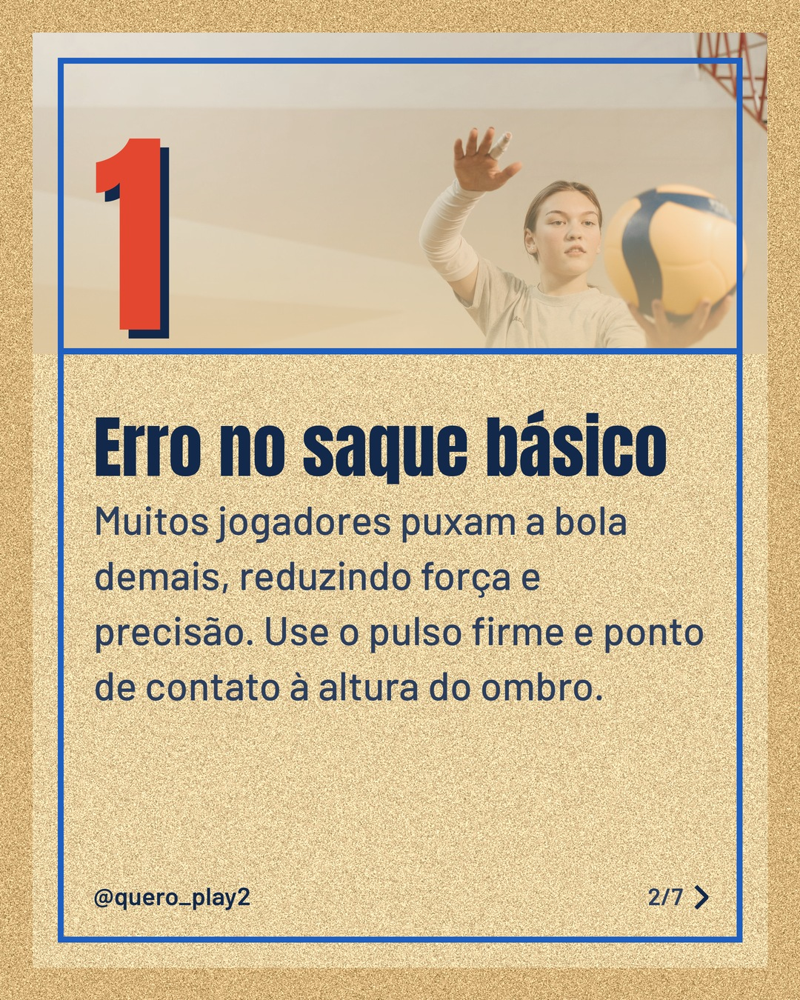
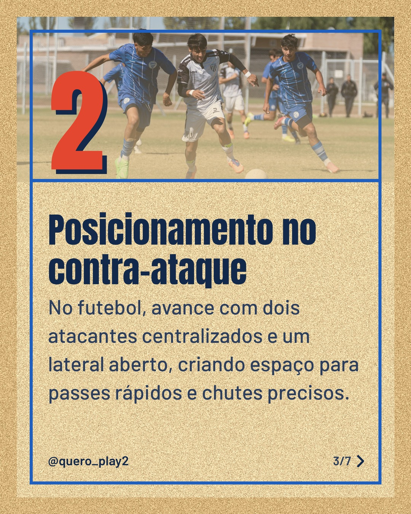
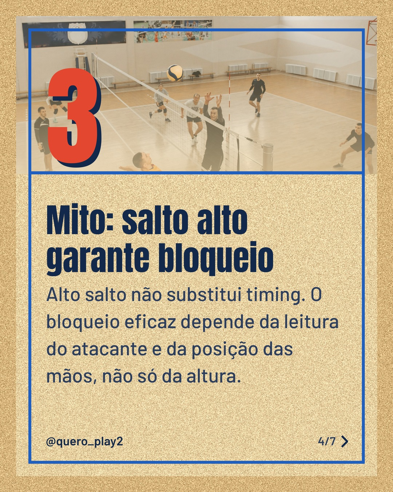
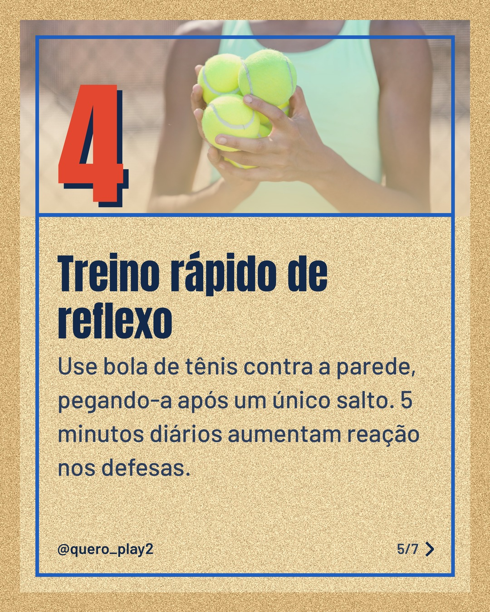
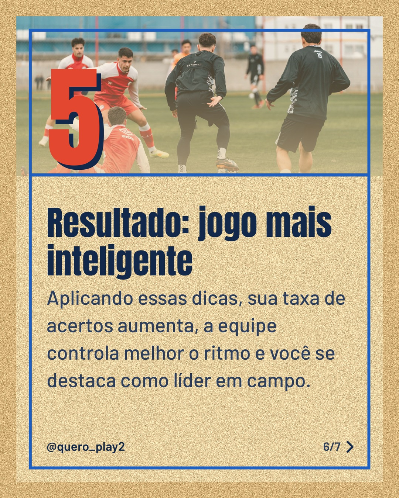

# areia

**Status:** aguardando revisão · 7 slides · gerado com `groq/openai/gpt-oss-120b`

      

## Legenda

> Você sabia que pequenos ajustes no saque ou no posicionamento podem mudar totalmente o desempenho? 🤔
>
> Neste carrossel, revelei erros comuns, desmistifiquei crenças e dei treinos simples para melhorar sua velocidade e leitura de jogo. 🚀
>
> Deslize para o lado, teste as dicas e me conta nos comentários como foi! Não esqueça de salvar e seguir para mais curiosidades. 🙌
>
> 📷 Fotos: Abi Greer, Pavel Danilyuk, Franco Monsalvo e RDNE Stock project (Pexels)
>
> #futebol #volei #dicasdefutebol #dicasdevolei #treinos #curiosidades #esporte #performance #futebolbrasil #voleibol

---
**Quer mudar algo?** Edite o `legenda.txt` para trocar a legenda, ou o `post.json` para trocar os textos dos slides (depois rode `python main.py redesenhar 2026-10-02_144159`).
Foto não combinou? `python main.py trocar-foto 2026-10-02_144159 N` (0 = capa, 1, 2... = slides).
Para descartar este post, apague esta pasta.
