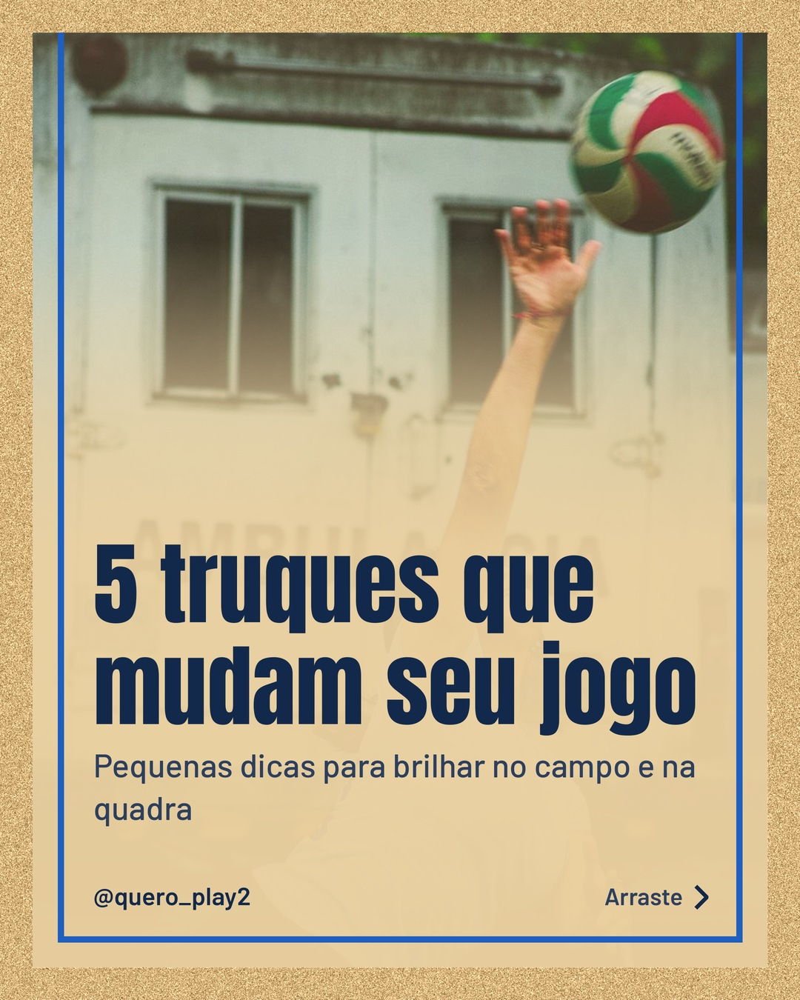
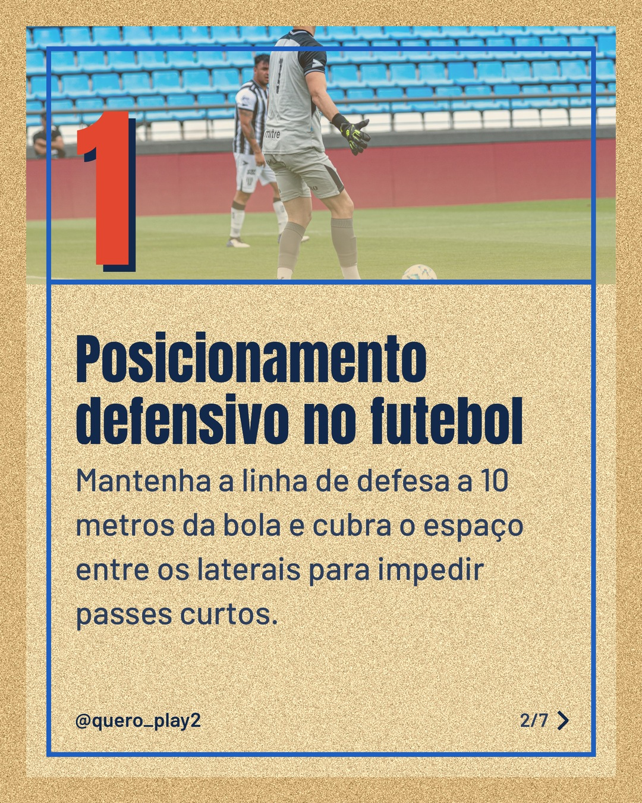
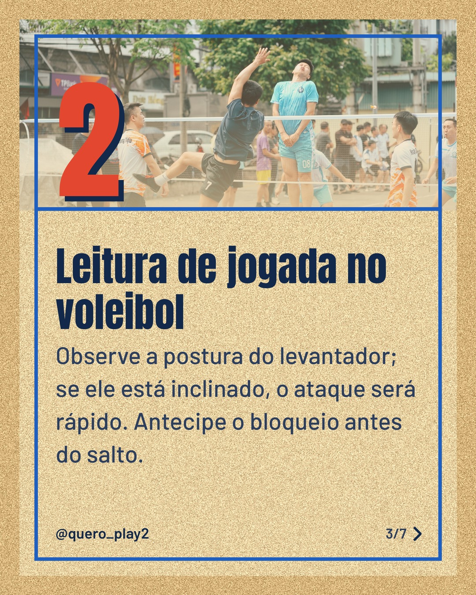
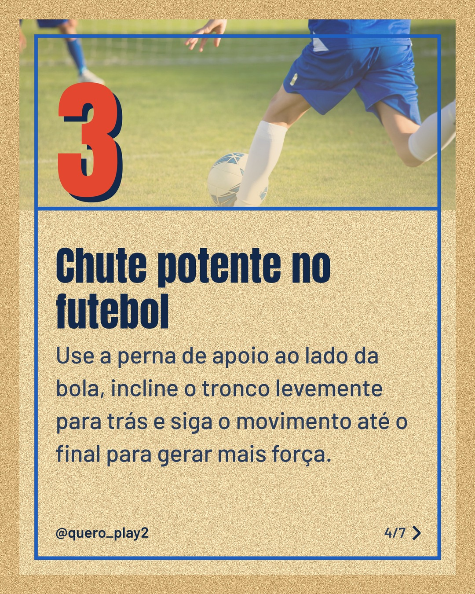
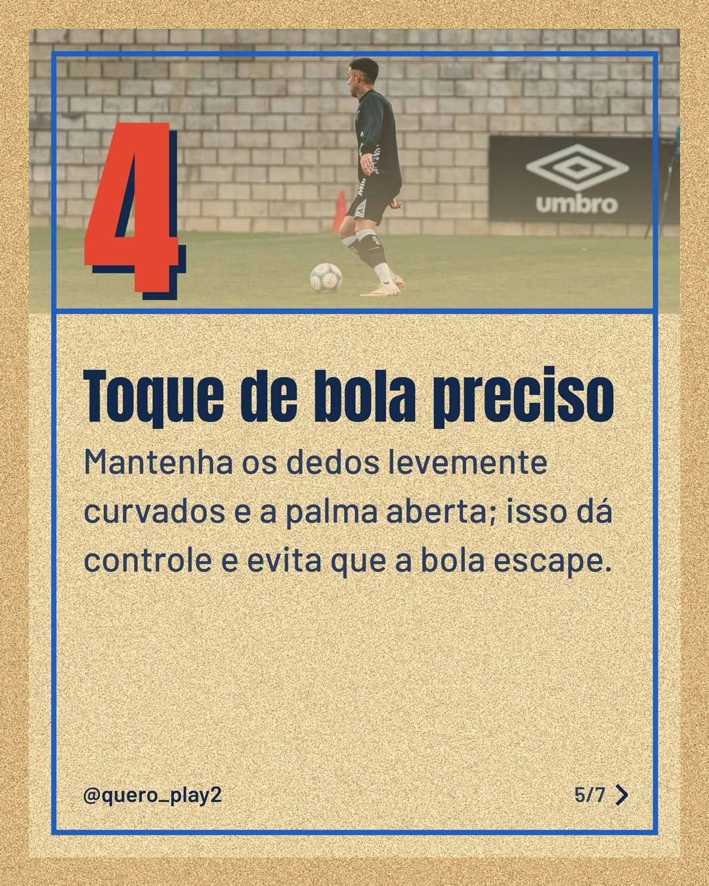
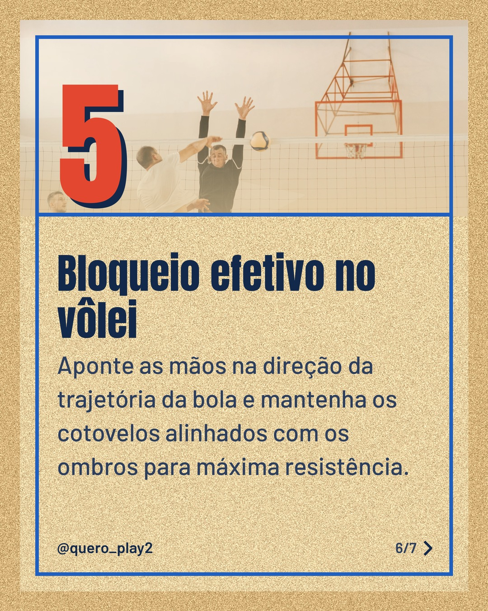
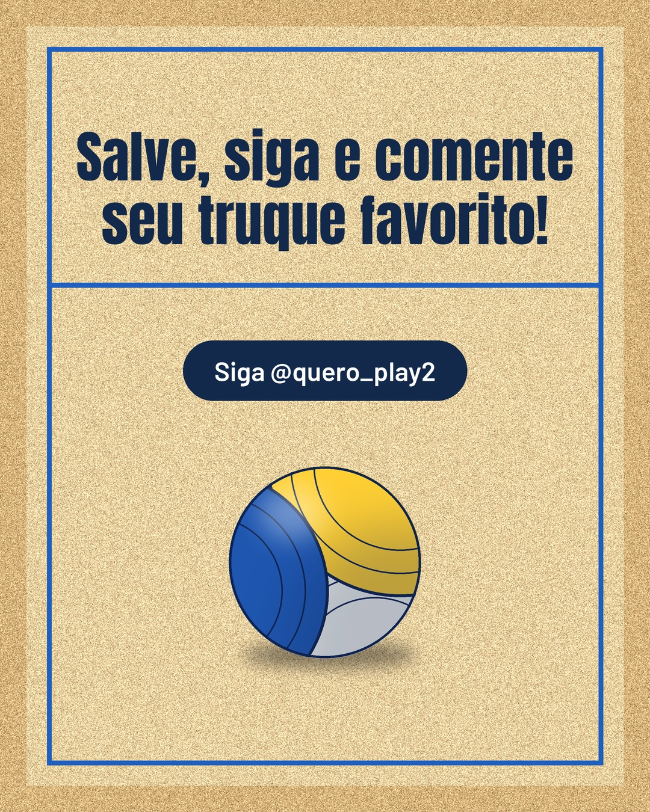

# areia

**Status:** aguardando revisão · 7 slides · gerado com `groq/openai/gpt-oss-120b`

      

## Legenda

> ⚽️ Você sabia que pequenos ajustes podem mudar o rumo de uma partida? Descubra como melhorar seu posicionamento, chute e toque de bola no futebol.
> 🏐 No vôlei, a leitura da jogada e o bloqueio eficaz são fundamentais. Cada detalhe conta para elevar seu nível.
> Deslize para o lado e aprenda cada dica prática. Salve este carrossel para treinar e compartilhe com quem também ama esses esportes! 🚀
>
> 📷 Fotos: Miguel Guerra, Franco Monsalvo, Thang Nguyen, Kampus Production e Pavel Danilyuk (Pexels)
>
> #futebol #volei #curiosidades #esporte #dicas #treinamento #habilidade #apaixonados #futebolbrasil #volei2024 #esportebrasil #aprendizado

---
**Quer mudar algo?** Edite o `legenda.txt` para trocar a legenda, ou o `post.json` para trocar os textos dos slides (depois rode `python main.py redesenhar 2026-10-03_130019`).
Foto não combinou? `python main.py trocar-foto 2026-10-03_130019 N` (0 = capa, 1, 2... = slides).
Para descartar este post, apague esta pasta.
