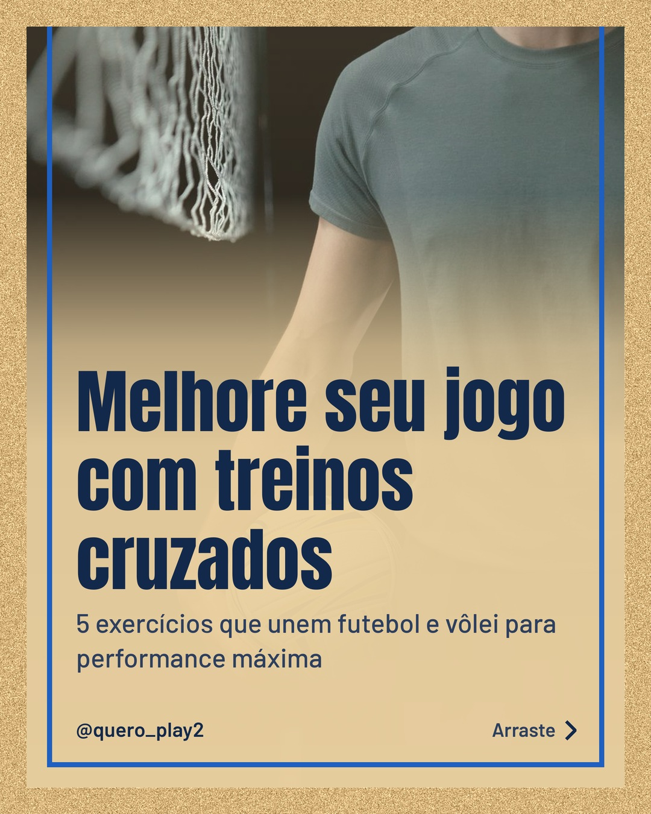
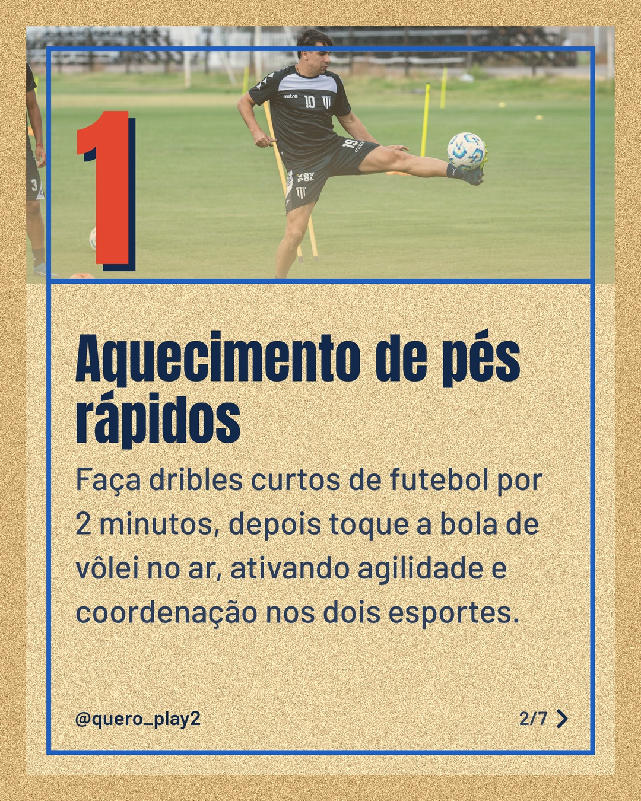
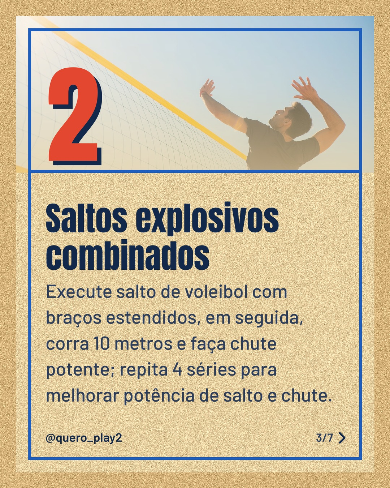
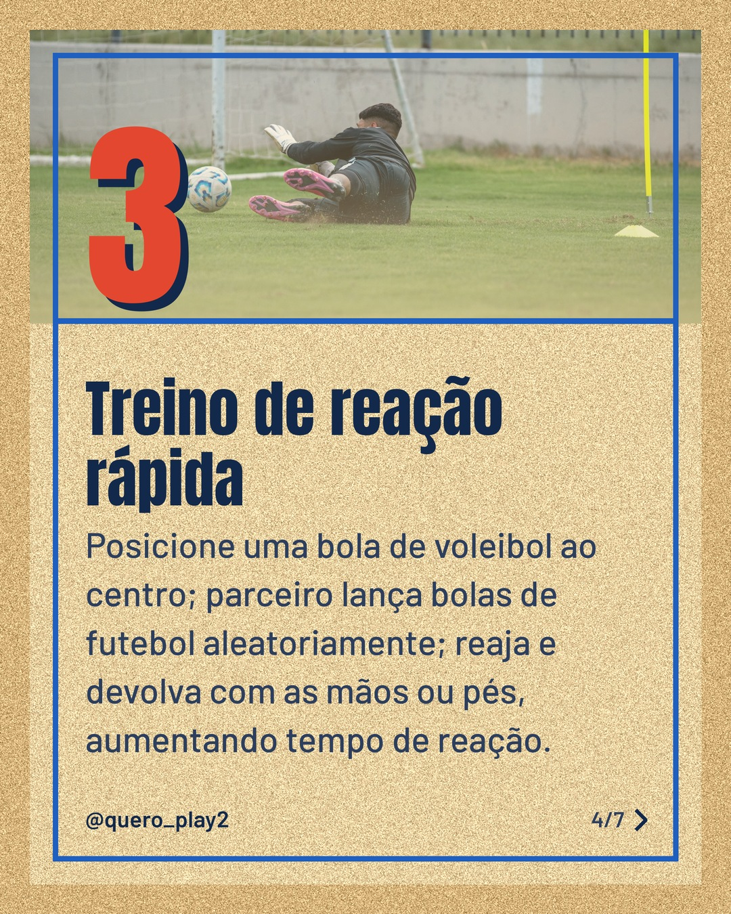
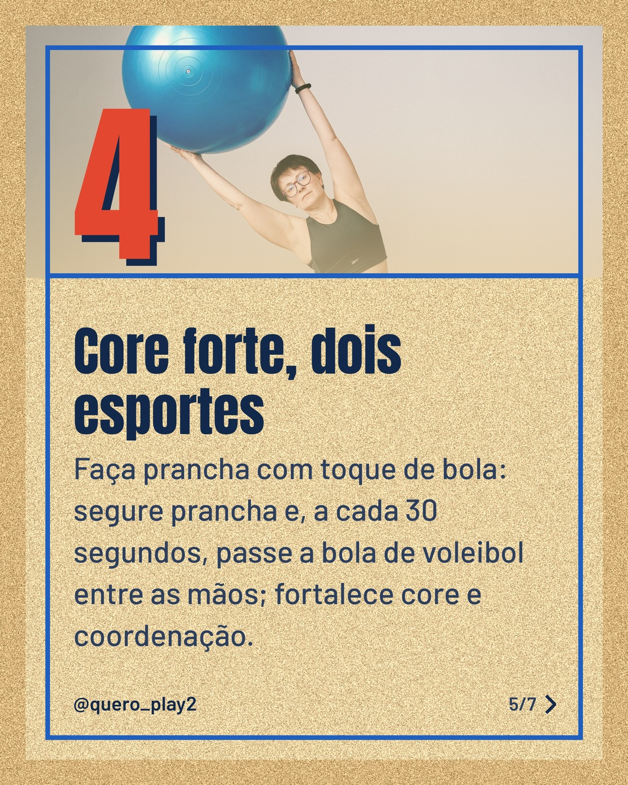
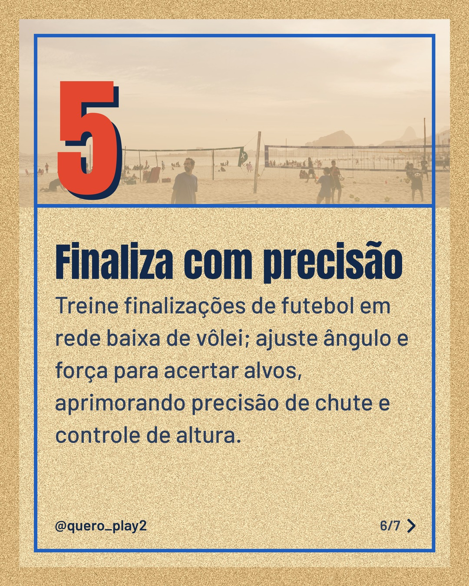
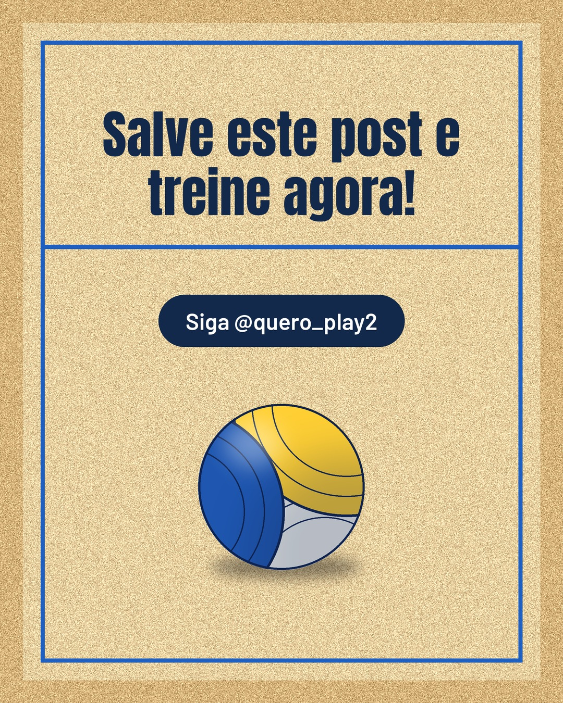

# areia

**Status:** aguardando revisão · 7 slides · gerado com `groq/openai/gpt-oss-120b`

      

## Legenda

> Já pensou em usar treinos de futebol para melhorar no vôlei e vice‑versa? 🤔
>
> Nos slides mostro 5 exercícios práticos que combinam agilidade, potência e precisão dos dois esportes. Cada um pode ser feito em 15 minutos, sozinho ou com parceiro.
>
> Deslize para a esquerda e descubra como potencializar sua performance. 👉 Salve, comente qual exercício você vai testar e siga para mais dicas!
>
> 📷 Fotos: cottonbro studio, Franco Monsalvo, Kampus Production, Anna Shvets e Cristiano Junior (Pexels)
>
> #futebol #volei #treinocrossado #agilidade #potencia #esporte #dicasdeesporte #treinamentofuncional #performance #atletismo #esportelife #treinos

---
**Quer mudar algo?** Edite o `legenda.txt` para trocar a legenda, ou o `post.json` para trocar os textos dos slides (depois rode `python main.py redesenhar 2026-10-04_134125`).
Foto não combinou? `python main.py trocar-foto 2026-10-04_134125 N` (0 = capa, 1, 2... = slides).
Para descartar este post, apague esta pasta.
