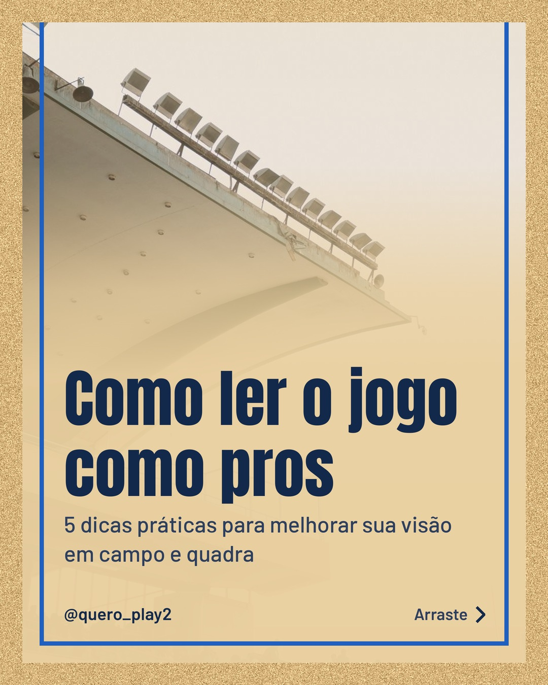
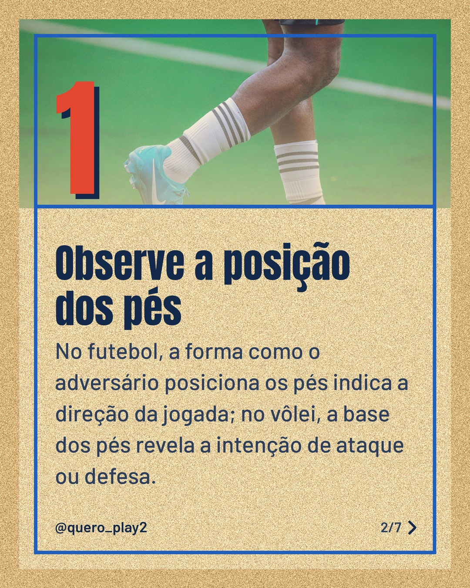
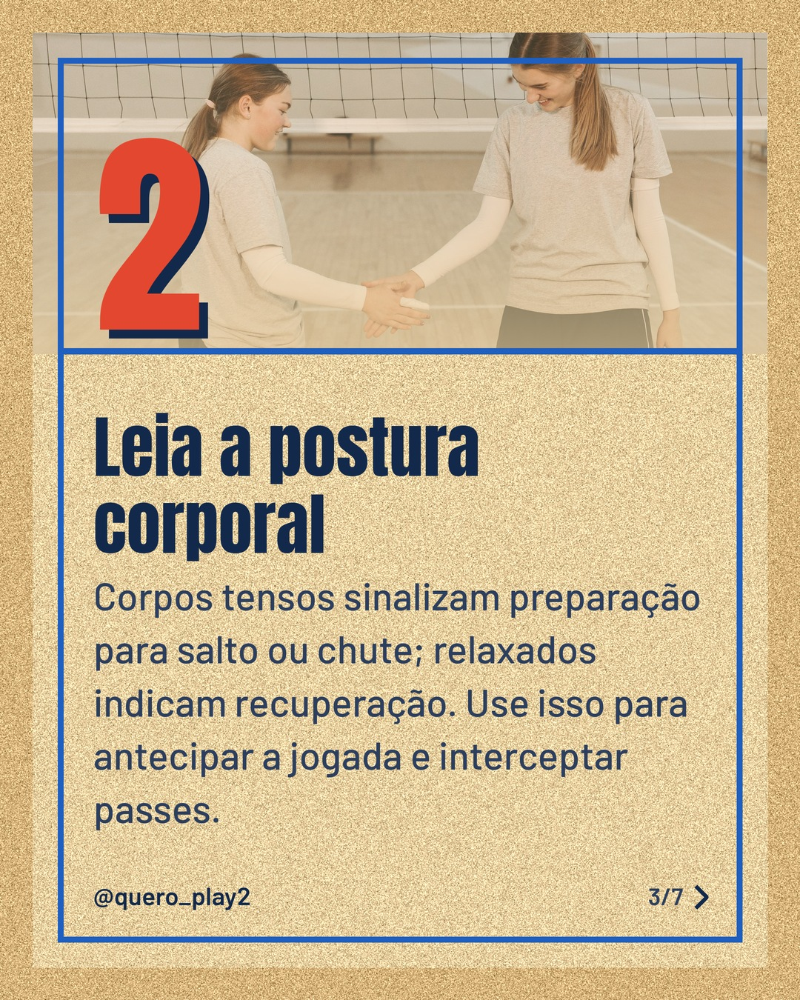
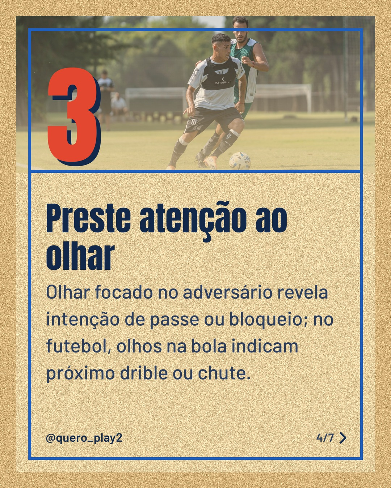
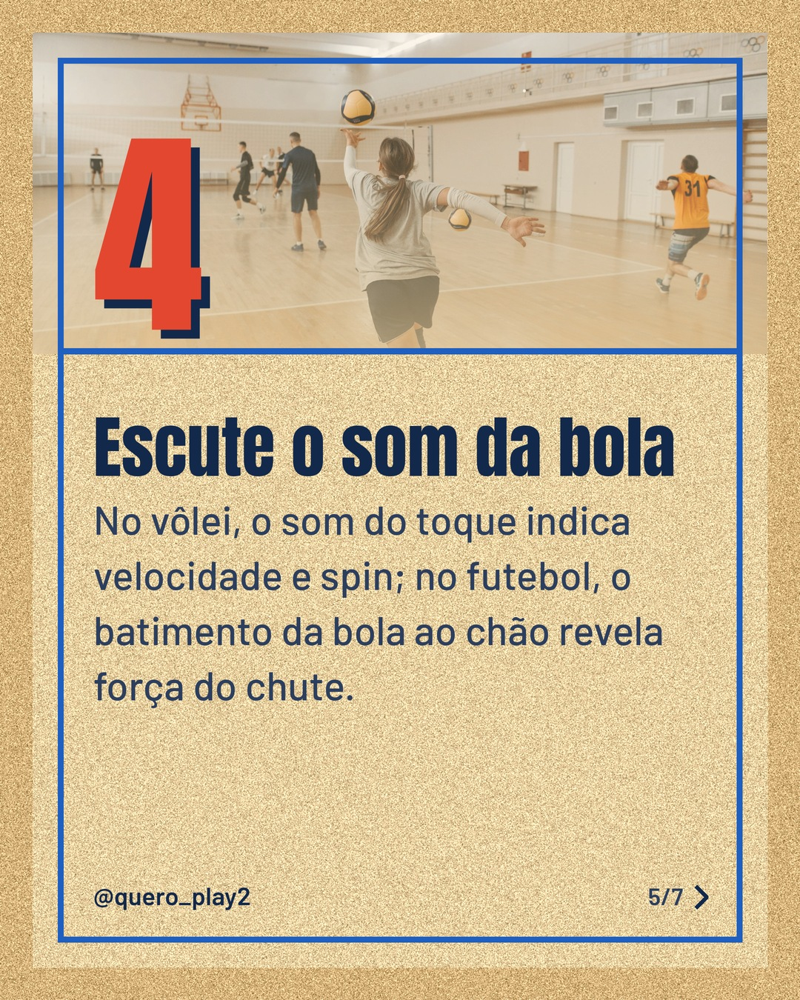
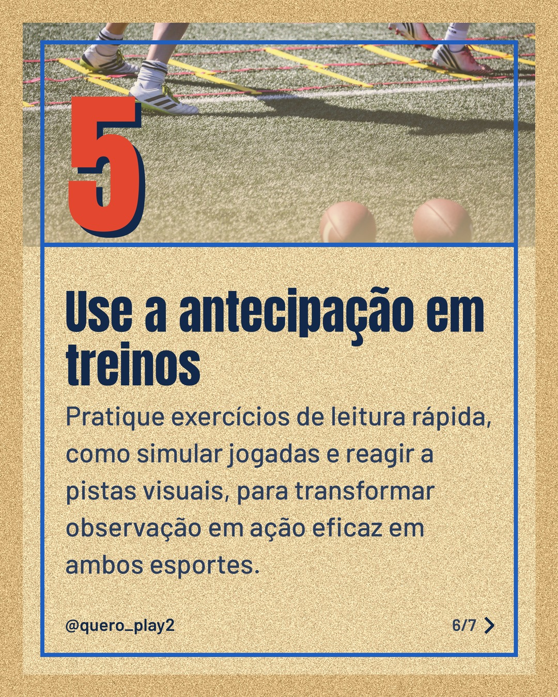

# areia

**Status:** aguardando revisão · 7 slides · gerado com `groq/openai/gpt-oss-120b`

      

## Legenda

> Já percebeu como pequenos detalhes podem mudar o rumo de uma partida? 📚⚽️🏐
>
> Neste carrossel eu trouxe 5 dicas práticas para você observar a posição dos pés, postura, olhar, som da bola e treinar a antecipação. Cada detalhe ajuda a prever a jogada antes que ela aconteça.
>
> Deslize para a esquerda e descubra como aplicar essas técnicas no seu próximo treino. 🚀 Não esqueça de salvar, curtir e marcar quem vai curtir essas dicas!
>
> 📷 Fotos: Axel Sandoval, El gringo photo, Pavel Danilyuk, Franco Monsalvo e Chris K (Pexels)
>
> #futebolcuriosidades #voleiCuriosidades #leituradejogo #dicasesportivas #treinamento #taticas #esporte #aprendizado #jogadores

---
**Quer mudar algo?** Edite o `legenda.txt` para trocar a legenda, ou o `post.json` para trocar os textos dos slides (depois rode `python main.py redesenhar 2026-10-06_150936`).
Foto não combinou? `python main.py trocar-foto 2026-10-06_150936 N` (0 = capa, 1, 2... = slides).
Para descartar este post, apague esta pasta.
