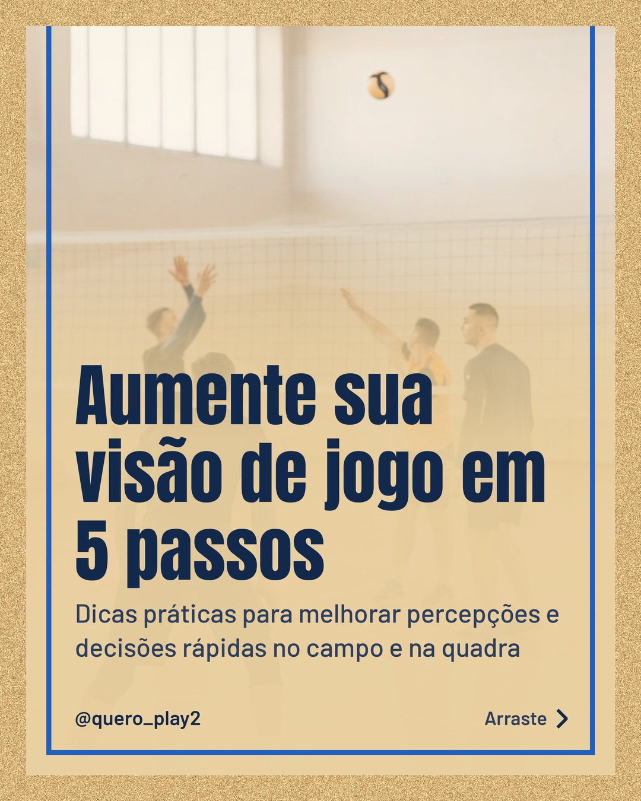
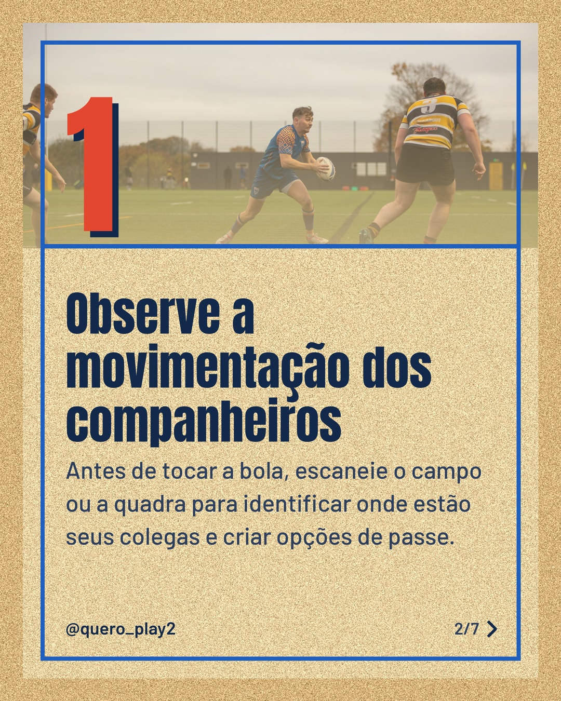
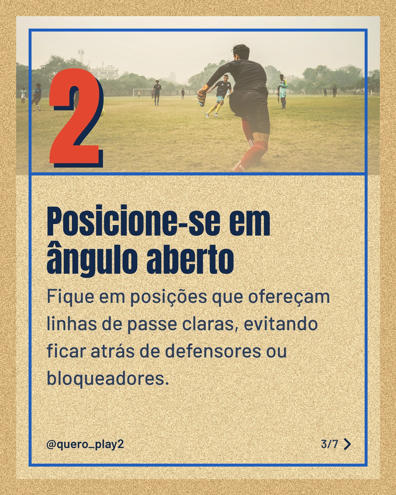
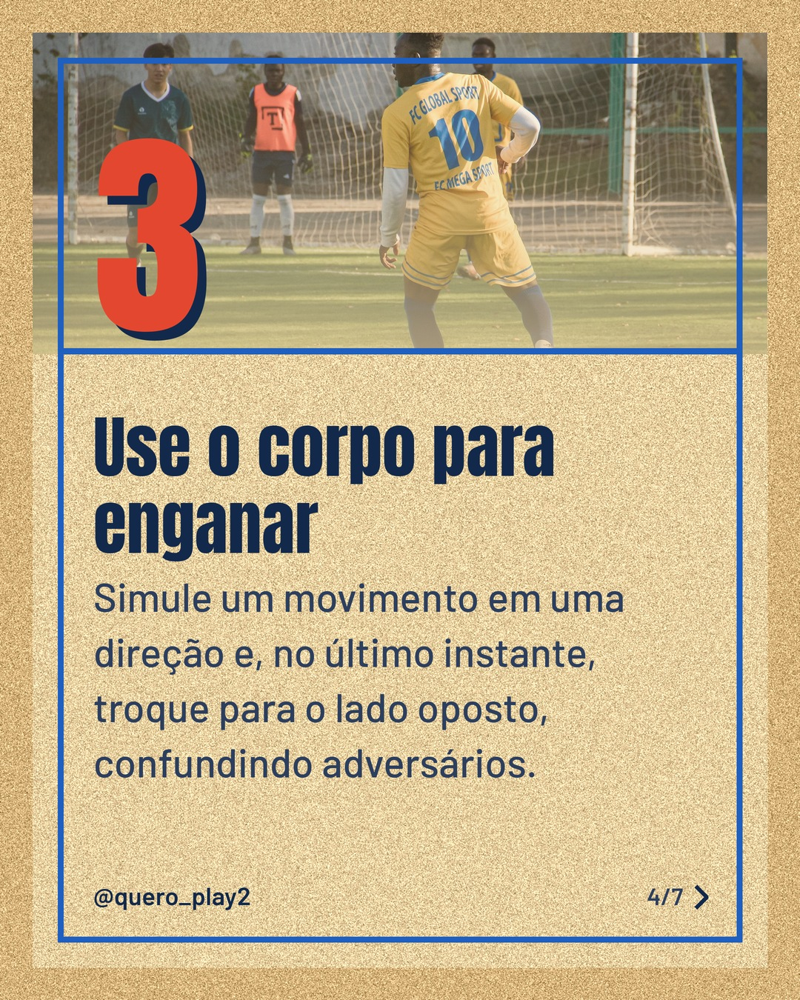
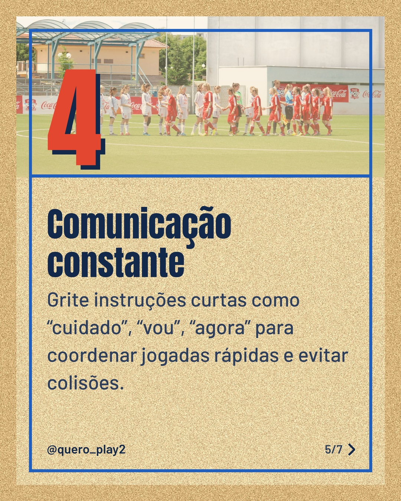
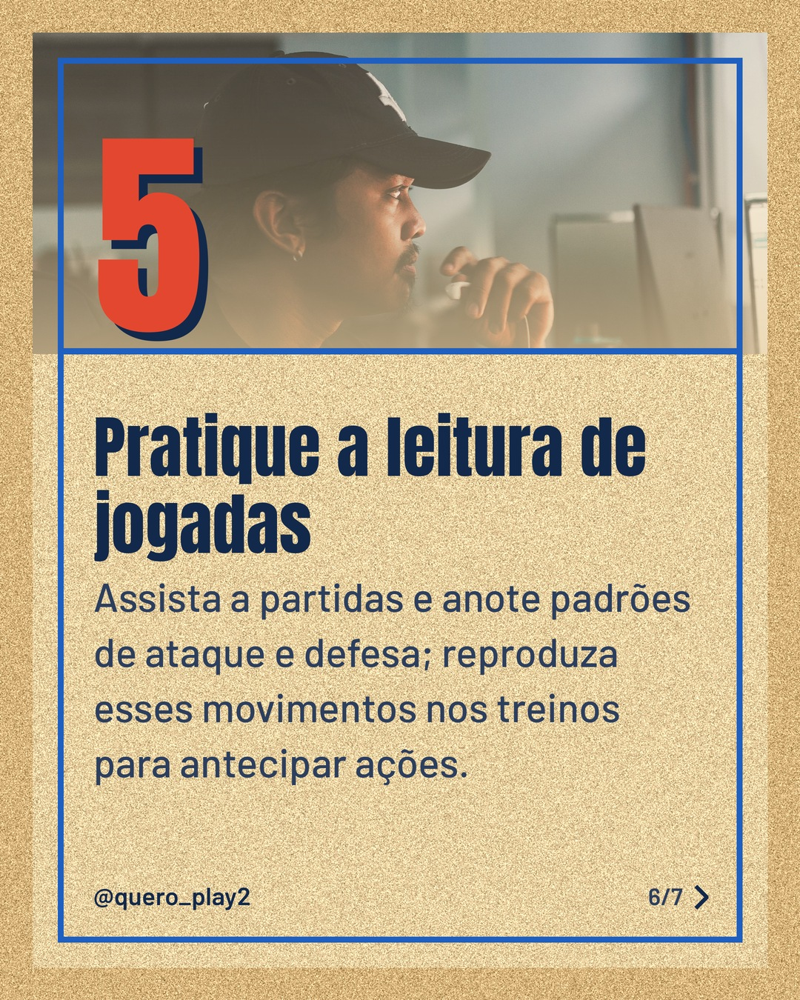

# areia

**Status:** aguardando revisão · 7 slides · gerado com `groq/openai/gpt-oss-120b`

      

## Legenda

> Quer saber como ler melhor o jogo e tomar decisões certeiras? 🧠⚽🏐
> Deslize para o lado e descubra 5 dicas simples que você pode aplicar nos treinos e nas partidas.
> Curtiu? Deixe seu comentário, compartilhe e siga para mais curiosidades e técnicas esportivas! 👍
>
> 📷 Fotos: Pavel Danilyuk, Ollie Craig, Yogendra  Singh, Taiye Salawu, Martin Boháč e Kobe - (Pexels)
>
> #futebol #volei #esporte #dicasdesportivas #treinamento #visãodejogo #técnicas #performance #jogadores #jogos

---
**Quer mudar algo?** Edite o `legenda.txt` para trocar a legenda, ou o `post.json` para trocar os textos dos slides (depois rode `python main.py redesenhar 2026-10-07_154234`).
Foto não combinou? `python main.py trocar-foto 2026-10-07_154234 N` (0 = capa, 1, 2... = slides).
Para descartar este post, apague esta pasta.
