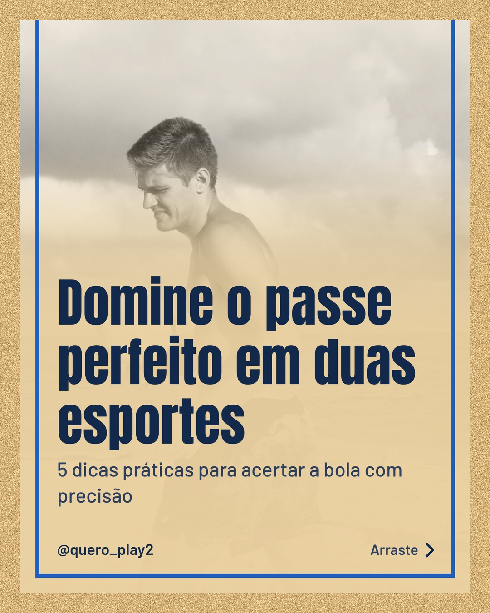
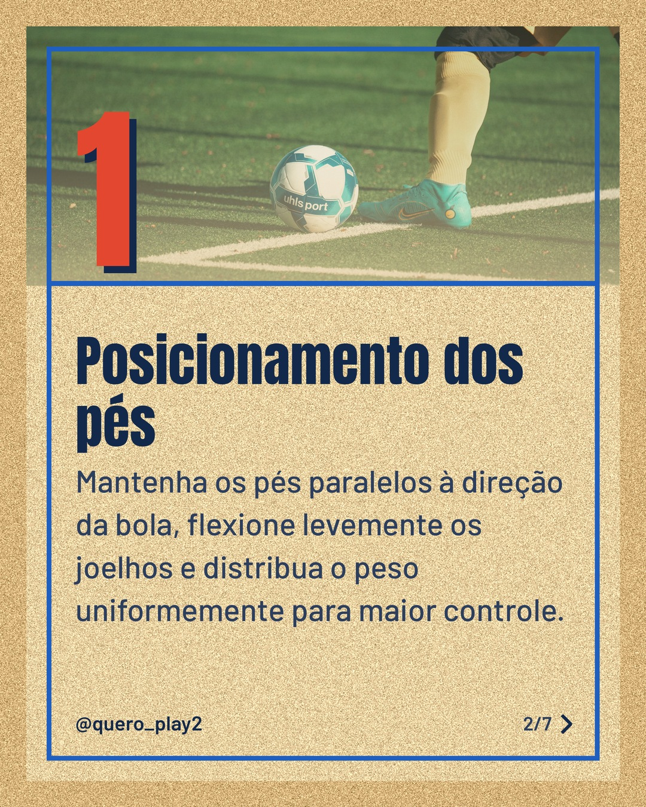
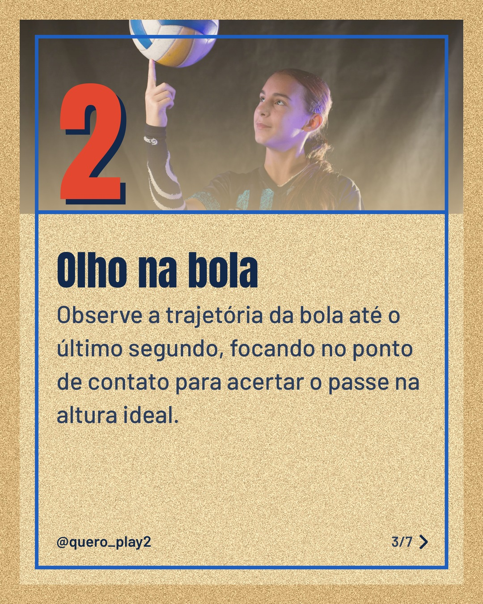
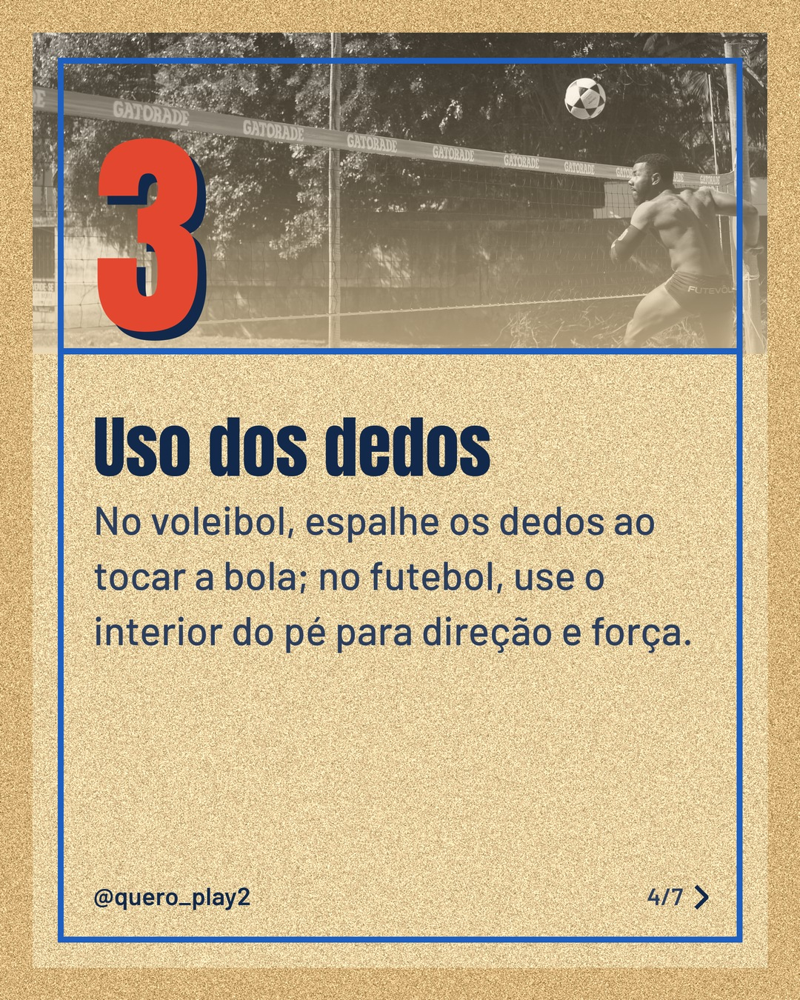
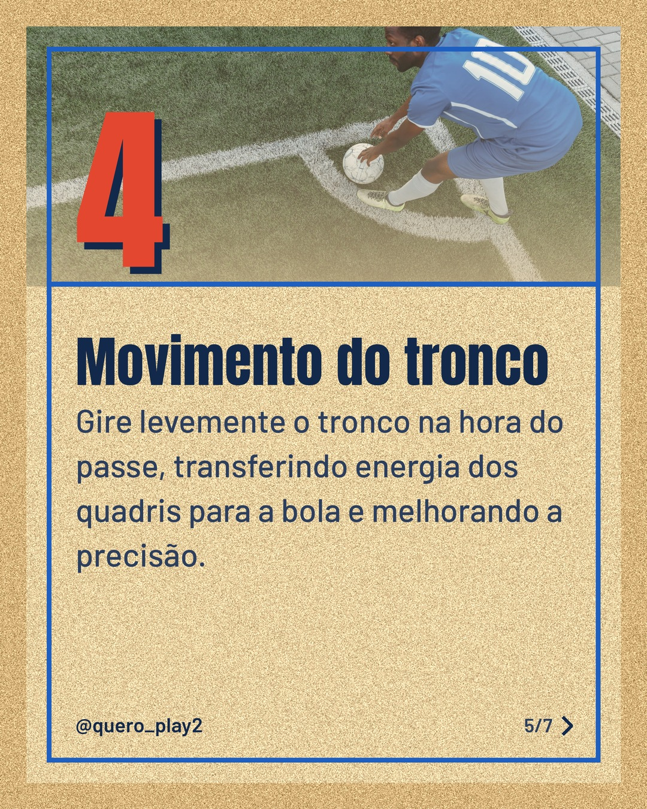
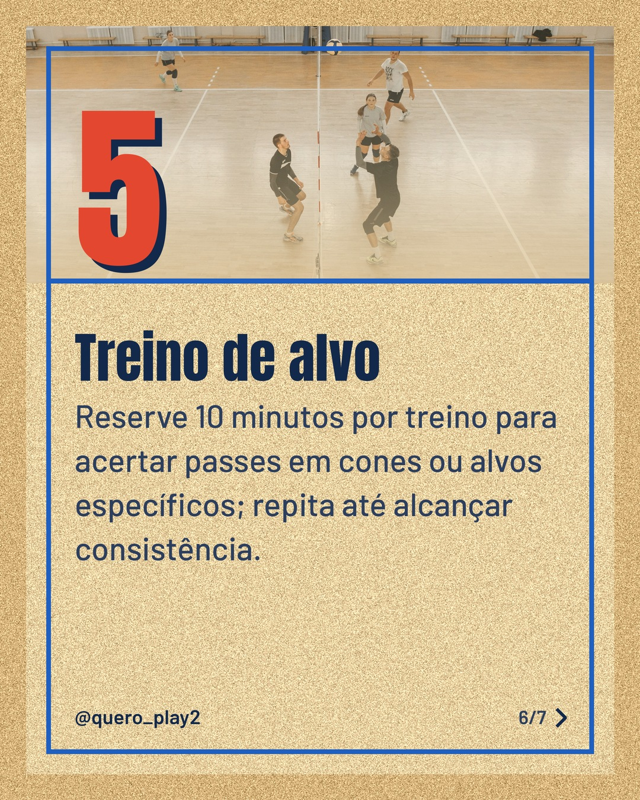
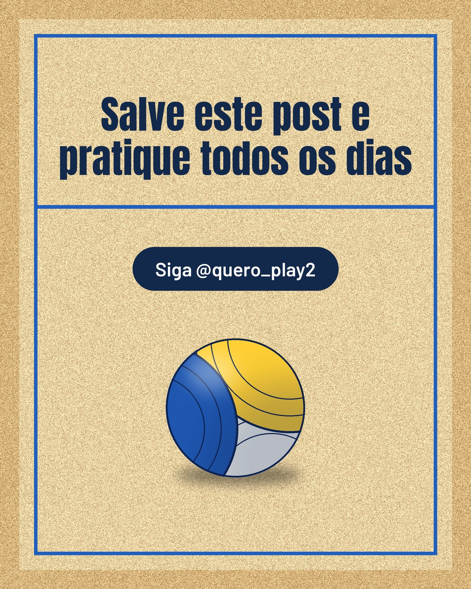

# areia

**Status:** aguardando revisão · 7 slides · gerado com `groq/openai/gpt-oss-120b`

      

## Legenda

> ⚽️ Já pensou em melhorar seus passes tanto no futebol quanto no vôlei? Cada detalhe conta e hoje eu trouxe 5 dicas rápidas para você arrasar nas quadras e nos campos.
> Deslize para o lado e descubra cada passo: posicionamento, foco, dedos, tronco e treino de alvo. Simples, prático e fácil de aplicar no seu dia a dia.
> Curtiu? Deixe seu comentário, compartilhe com os amigos e siga para mais curiosidades esportivas! 🏐
>
> 📷 Fotos: Alejandra D, Omar Ramadan, maximiliano morgante, Renan Braz, Thirdman e Pavel Danilyuk (Pexels)
>
> #futebol #volei #esporte #dicas #treino #passes #precisao #curiosidades #futebolbrasil #volebrazil #sporttips #atletas

---
**Quer mudar algo?** Edite o `legenda.txt` para trocar a legenda, ou o `post.json` para trocar os textos dos slides (depois rode `python main.py redesenhar 2026-10-08_154052`).
Foto não combinou? `python main.py trocar-foto 2026-10-08_154052 N` (0 = capa, 1, 2... = slides).
Para descartar este post, apague esta pasta.
