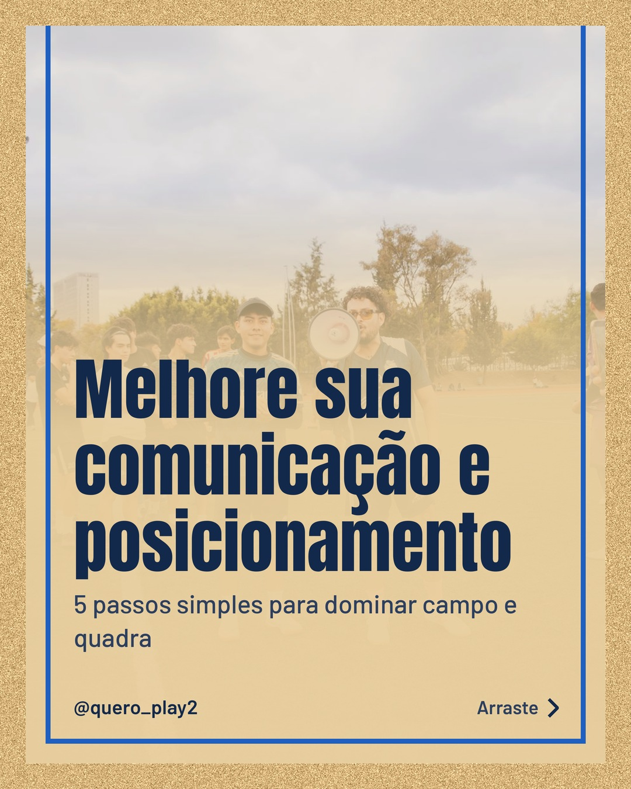
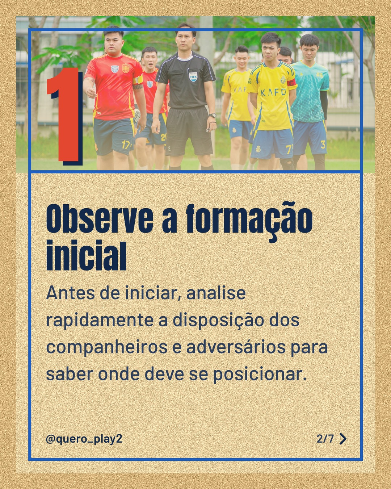
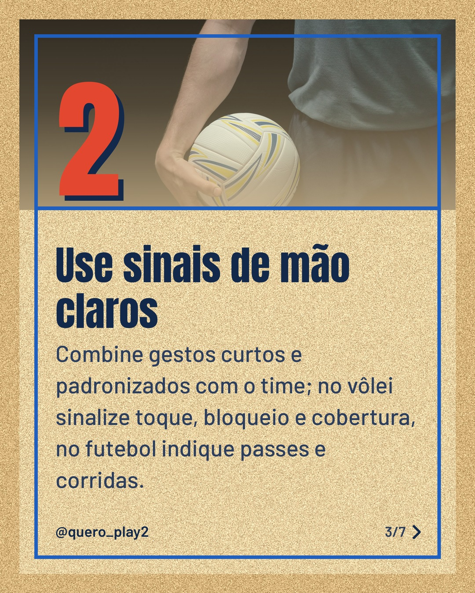
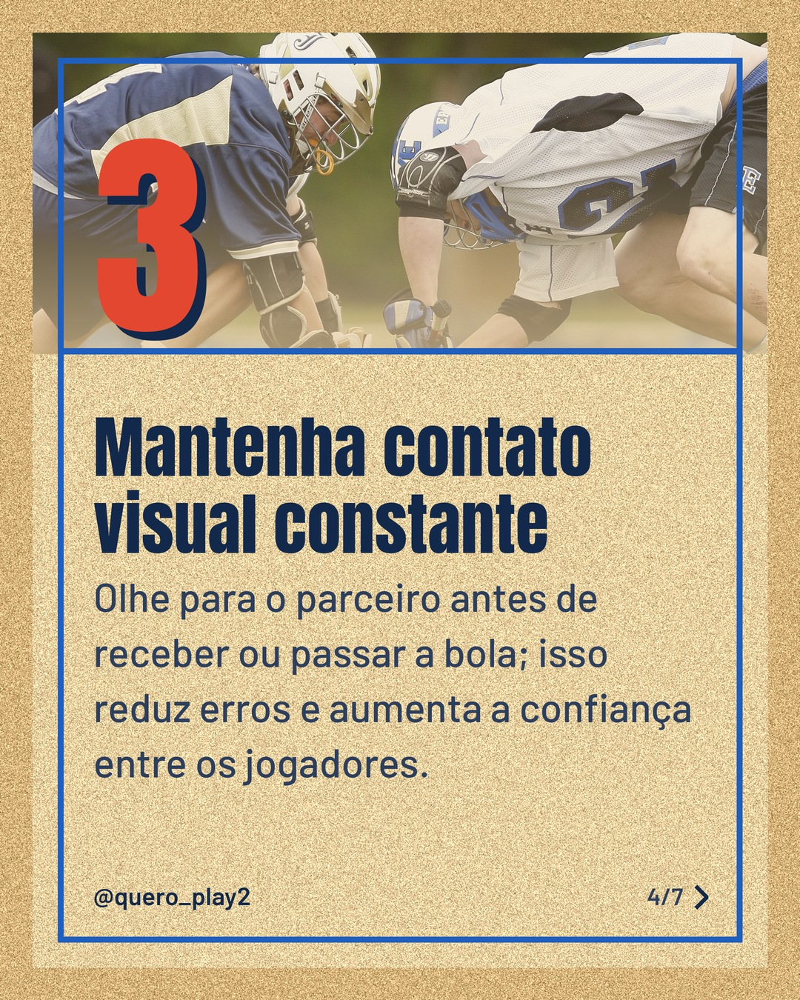
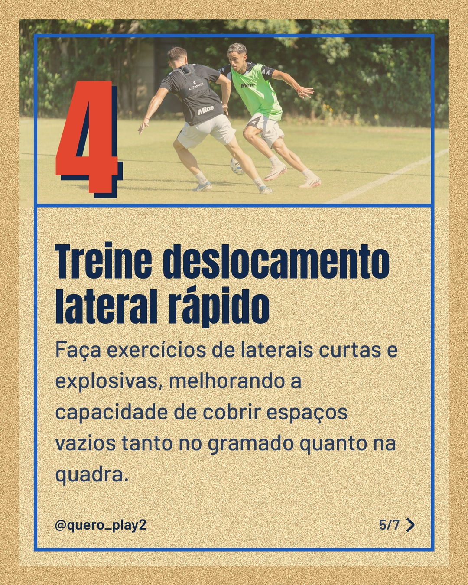
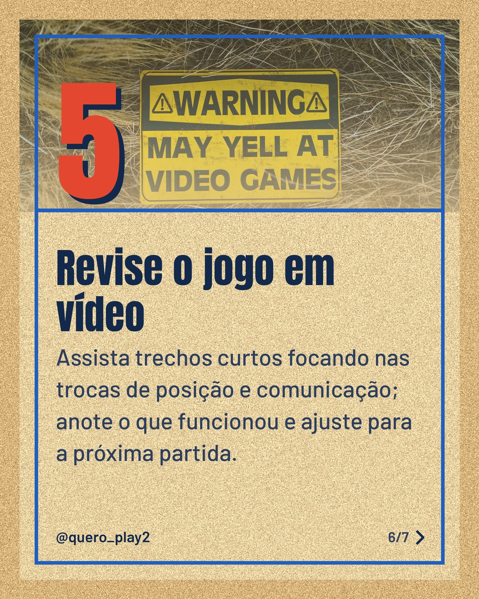
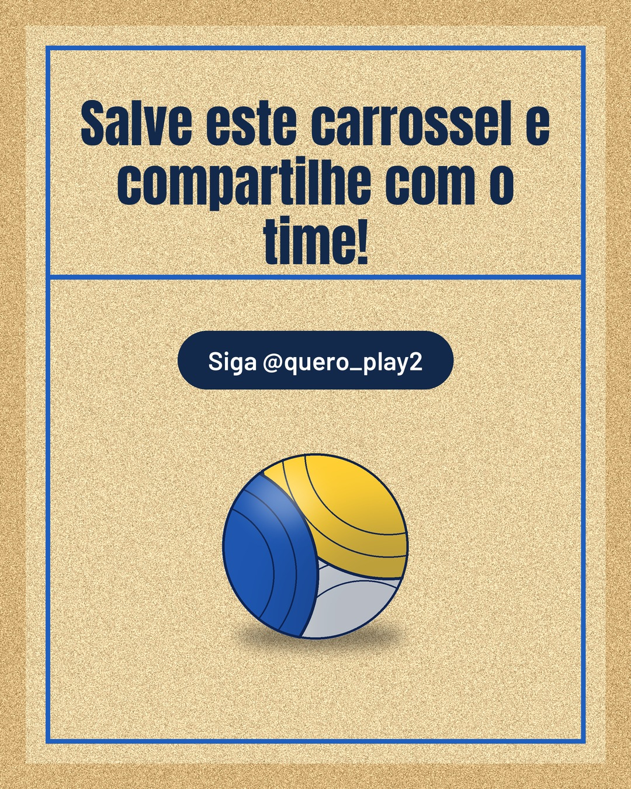

# areia

**Status:** aguardando revisão · 7 slides · gerado com `groq/openai/gpt-oss-120b`

      

## Legenda

> Comunicação e posicionamento são a base de qualquer equipe vencedora, seja no futebol ou no vôlei. 💬⚽🏐
> Descubra 5 dicas práticas que você pode aplicar já nos treinos e jogos. Deslize para o lado e veja cada passo.
> Teste as técnicas, ajuste ao seu estilo e veja a diferença na próxima partida. Marque quem precisa melhorar também! 💡
> Curtiu? Deixe um comentário, siga para mais curiosidades e salve para rever sempre!
>
> 📷 Fotos: César O'neill, Anh Lee, cottonbro studio, Pixabay, Franco Monsalvo e RDNE Stock project (Pexels)
>
> #futebol #volei #comunicacaoesportiva #posicionamento #dicasdefutebol #dicasdevolei #treinamento #esportelivre #time #taticasesportivas #jogoemequipe

---
**Quer mudar algo?** Edite o `legenda.txt` para trocar a legenda, ou o `post.json` para trocar os textos dos slides (depois rode `python main.py redesenhar 2026-10-09_151137`).
Foto não combinou? `python main.py trocar-foto 2026-10-09_151137 N` (0 = capa, 1, 2... = slides).
Para descartar este post, apague esta pasta.
