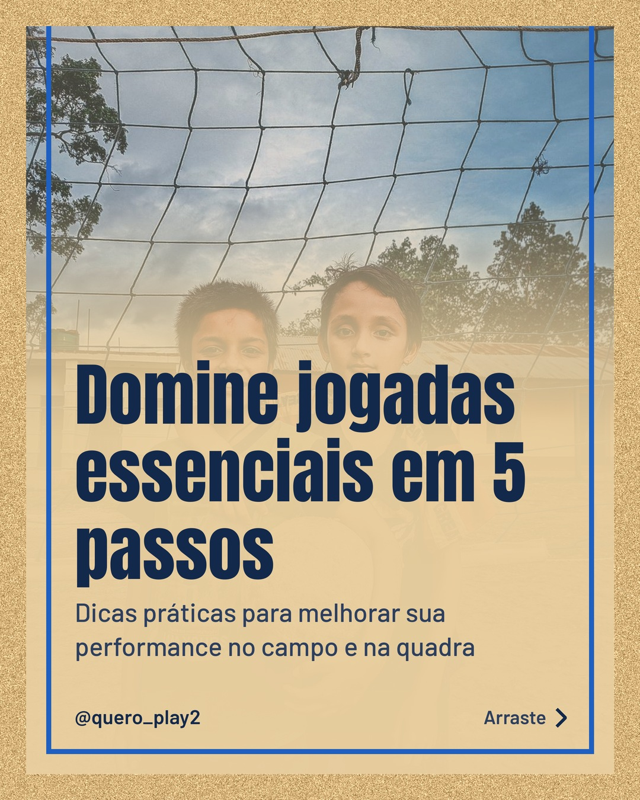
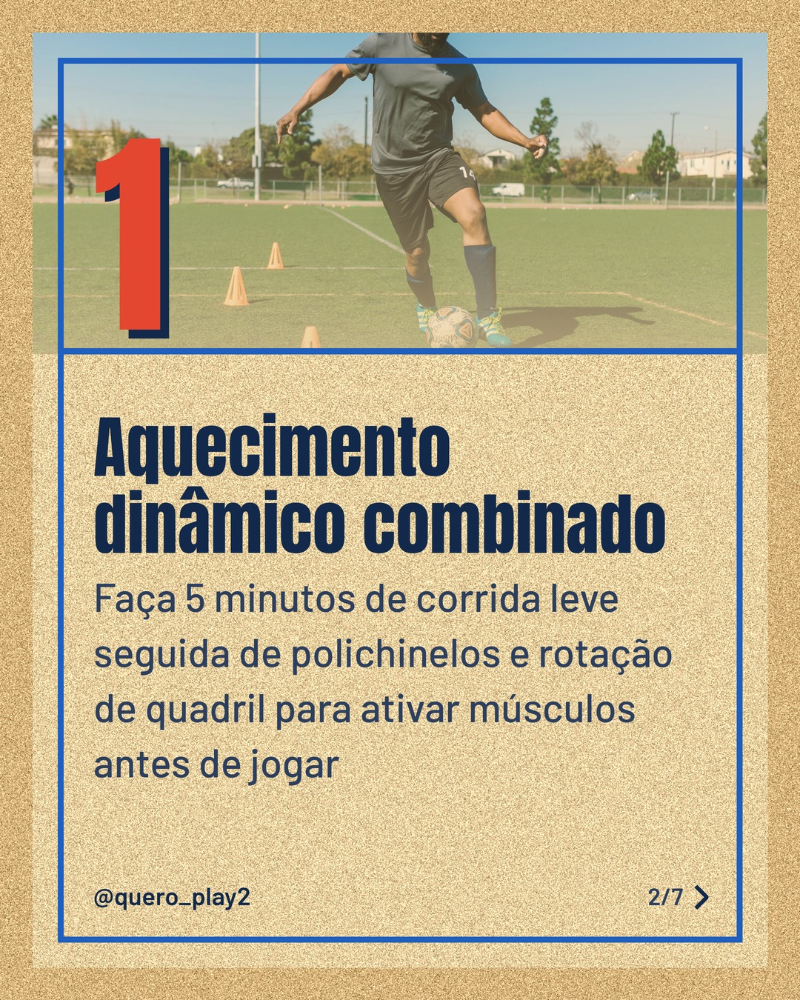
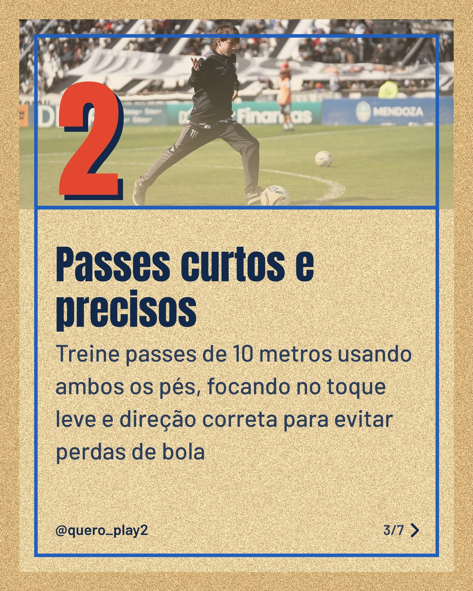
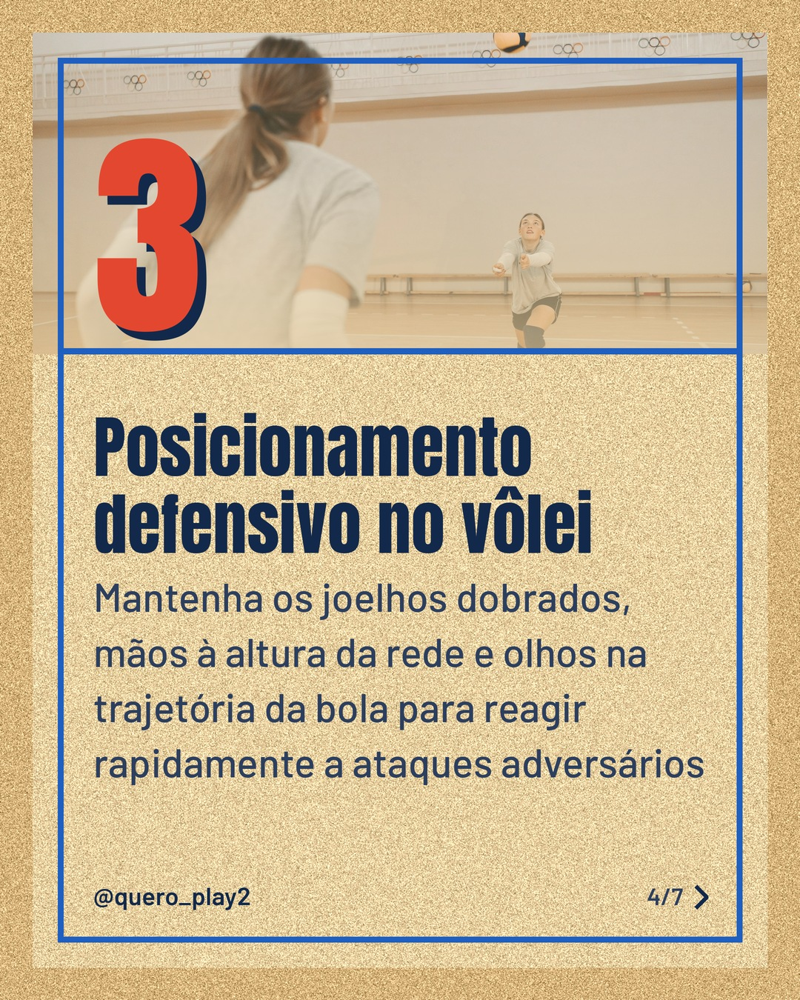
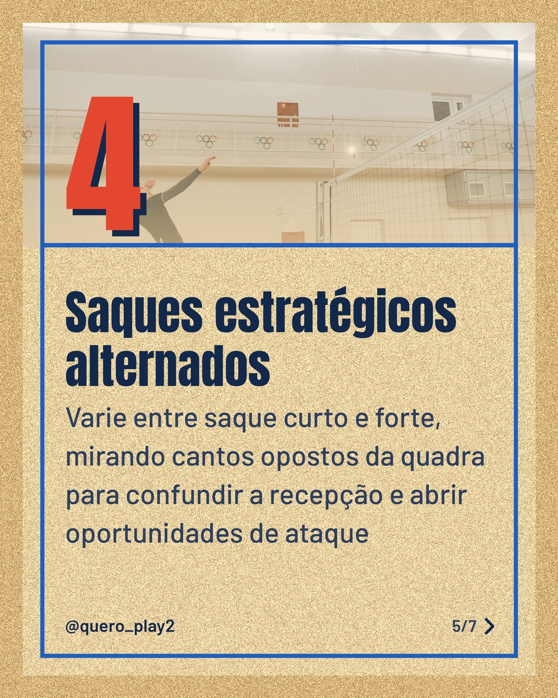
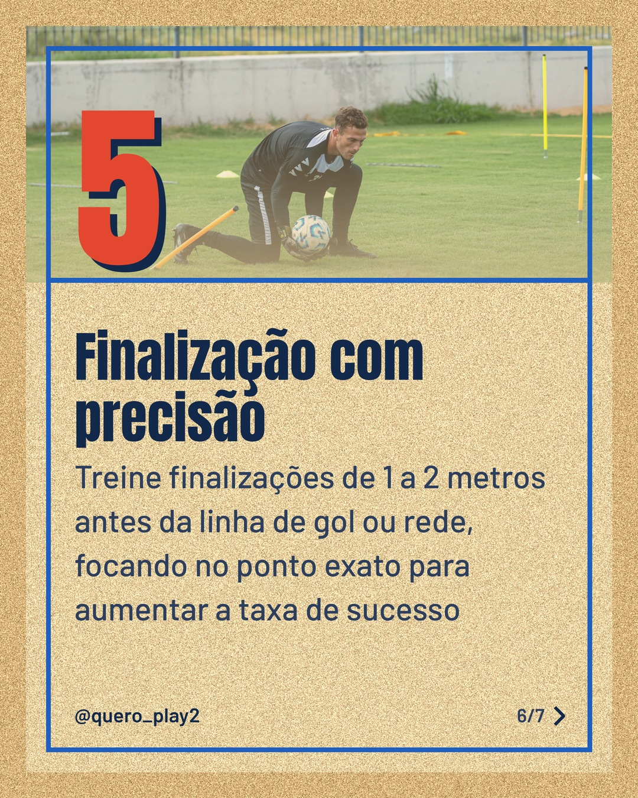

# areia

**Status:** aguardando revisão · 7 slides · gerado com `groq/openai/gpt-oss-120b`

      

## Legenda

> Descubra como pequenos ajustes podem transformar seu jogo tanto no futebol quanto no vôlei. 📚
>
> Cada slide traz um passo simples para você aplicar já nos treinos. 🚀
>
> Deslize para o lado e comece a melhorar sua performance agora! 🔥
>
> Curtiu? Compartilhe, comente sua dica favorita e siga para mais curiosidades esportivas.
>
> 📷 Fotos: GaNesh Gyawalee, RDNE Stock project, Franco Monsalvo e Pavel Danilyuk (Pexels)
>
> #futebolcuriosidades #voleiboldicas #esportesbrasil #futeboltreino #voleiboltreino #curiosidadessport #dicasfutebol #dicasvoleibol #esportesvida #treinoeficaz

---
**Quer mudar algo?** Edite o `legenda.txt` para trocar a legenda, ou o `post.json` para trocar os textos dos slides (depois rode `python main.py redesenhar 2026-10-10_141058`).
Foto não combinou? `python main.py trocar-foto 2026-10-10_141058 N` (0 = capa, 1, 2... = slides).
Para descartar este post, apague esta pasta.
