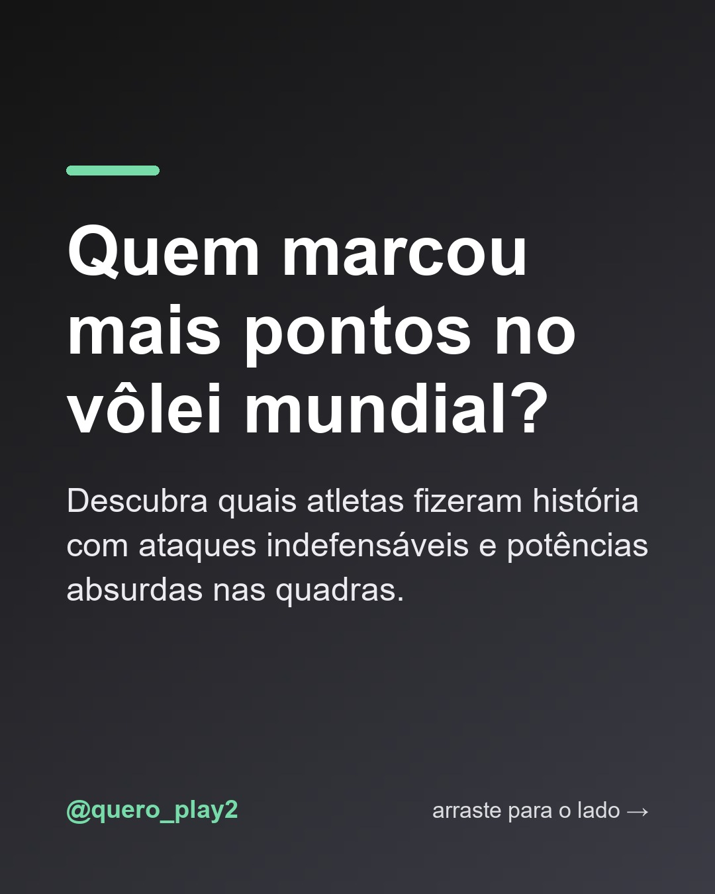
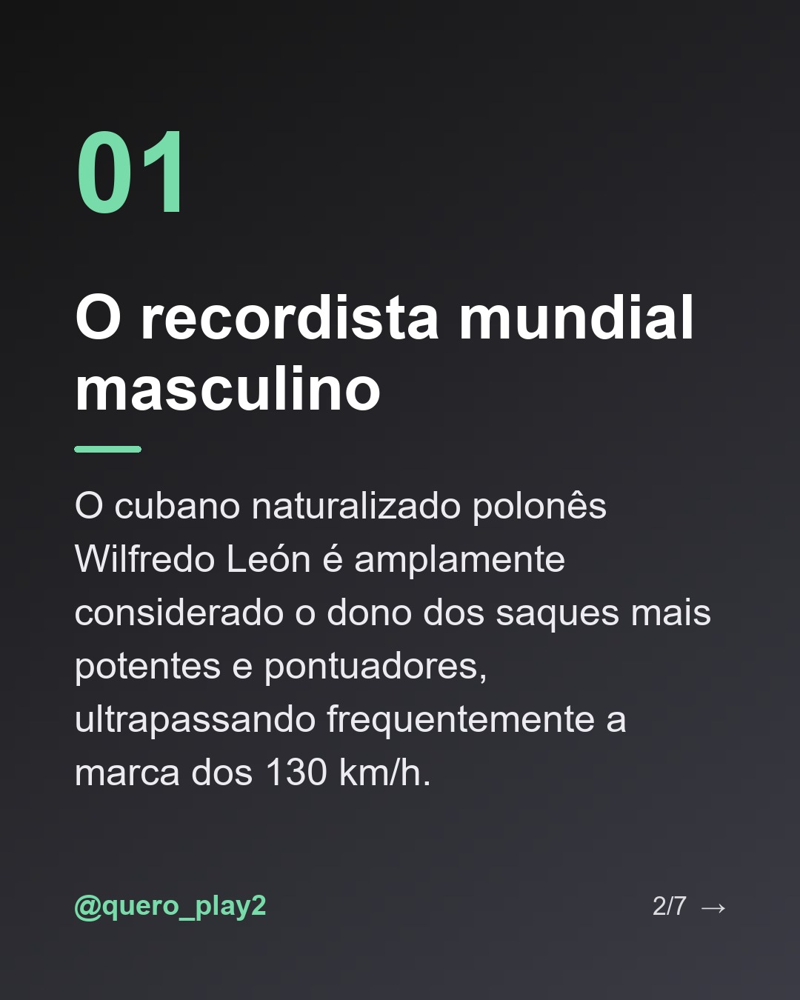
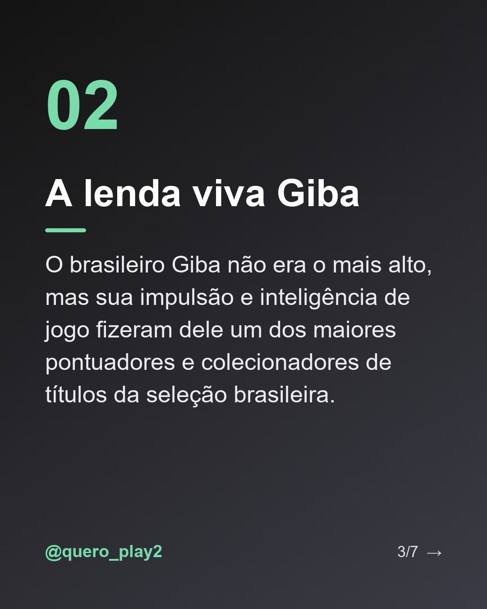
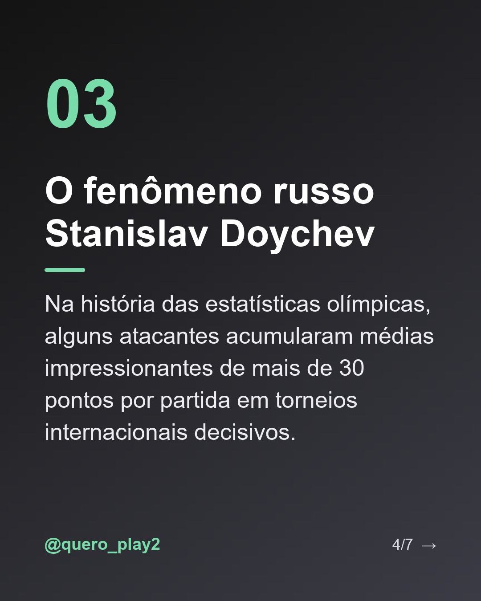
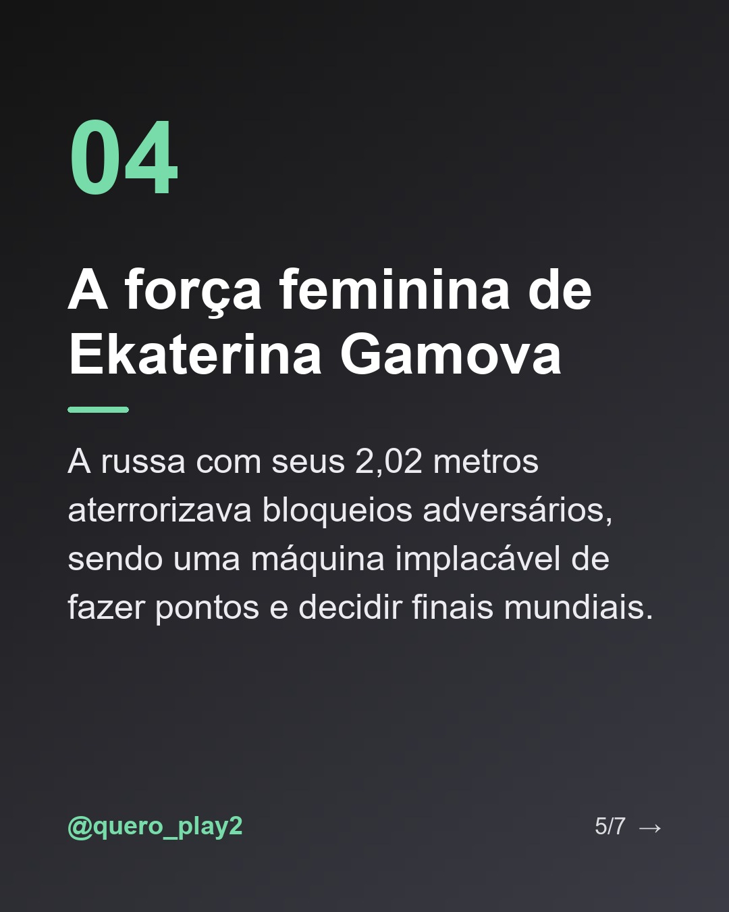
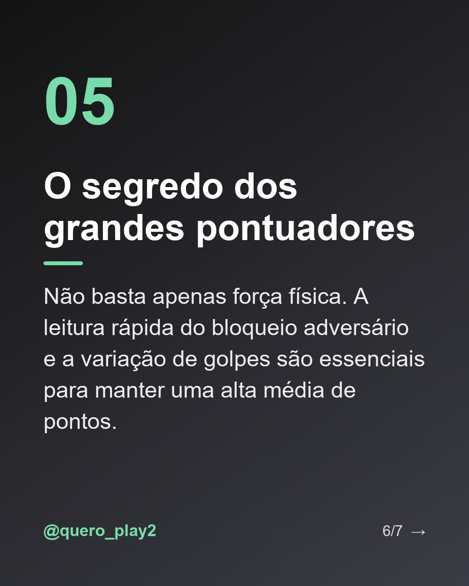

# maiores pontuadores da história do vôlei

**Status:** ✅ publicado · [ver no Instagram](https://www.instagram.com/p/Dd2hhKRjnww/) · 7 slides · gerado com `gemini/gemini-3.5-flash-lite`

      

## Legenda

> Você já parou para pensar em quem realmente manda na hora de pontuar no voleibol mundial? 🏐✨
>
> Neste carrossel, separei alguns dos nomes mais lendários que transformaram a arte de atacar em pura poesia (e muita potência!). De saques supersônicos a diagonais impossíveis, esses atletas marcaram época.
>
> Arrasta pro lado para conhecer os detalhes e me conta nos comentários: quem é o melhor atacante de todos os tempos para você? 👇
>
> #volei #volleyball #curiosidadesdovolei #giba #wilfredoleonn #superliga #voleibrasil #esportes #atletas #fatossobrevolei

---
**Quer mudar algo?** Edite o `legenda.txt` para trocar a legenda, ou o `post.json` para trocar os textos dos slides (depois rode `python main.py redesenhar 2026-09-26_174529`).
Para descartar este post, apague esta pasta.
