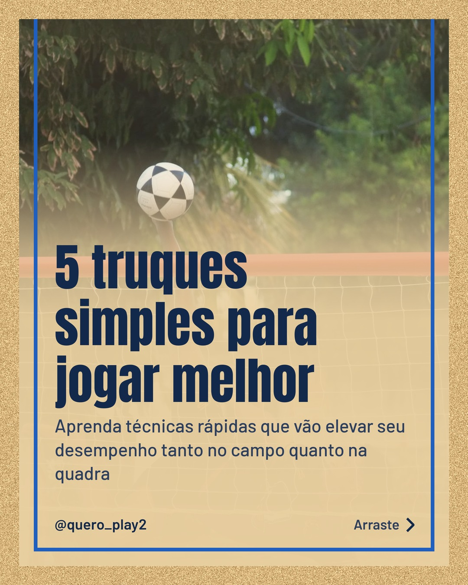
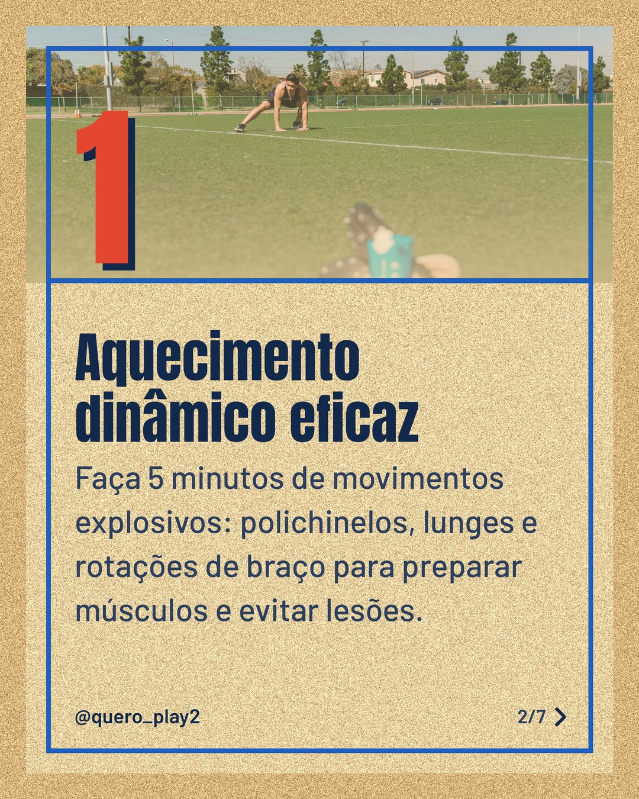
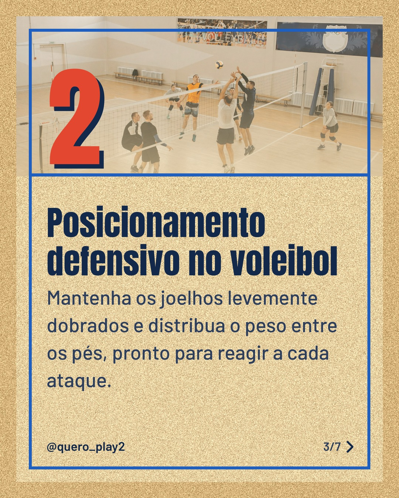
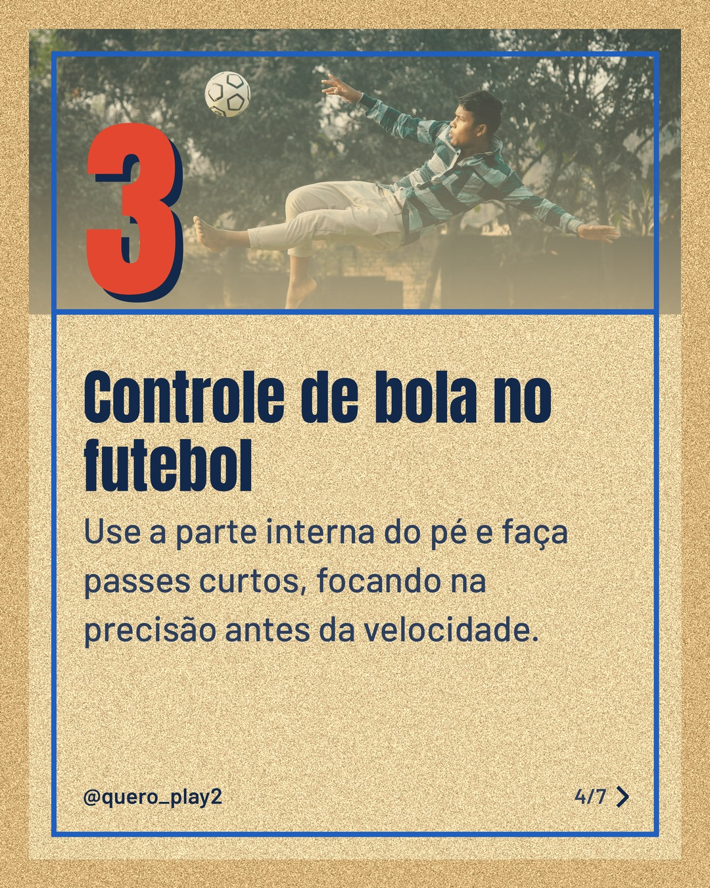
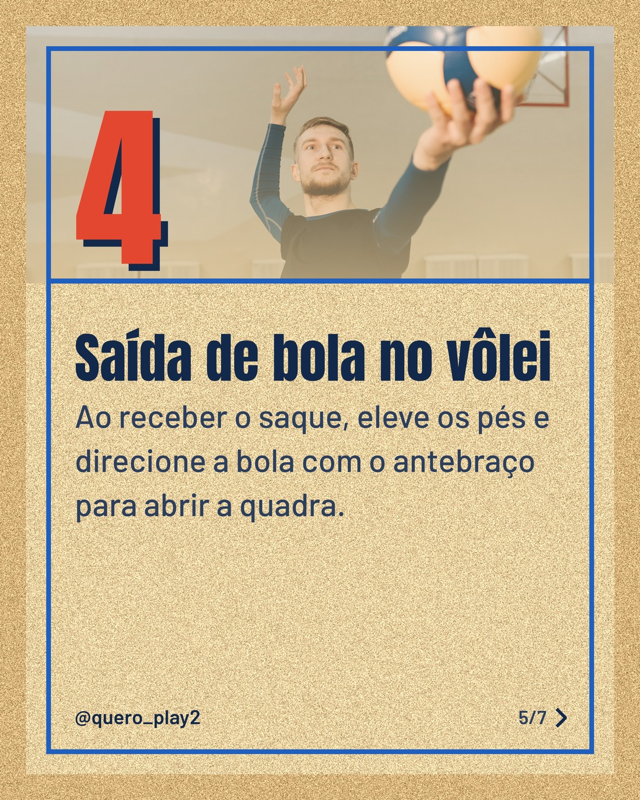
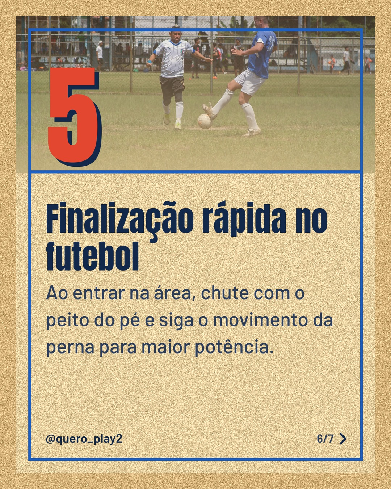
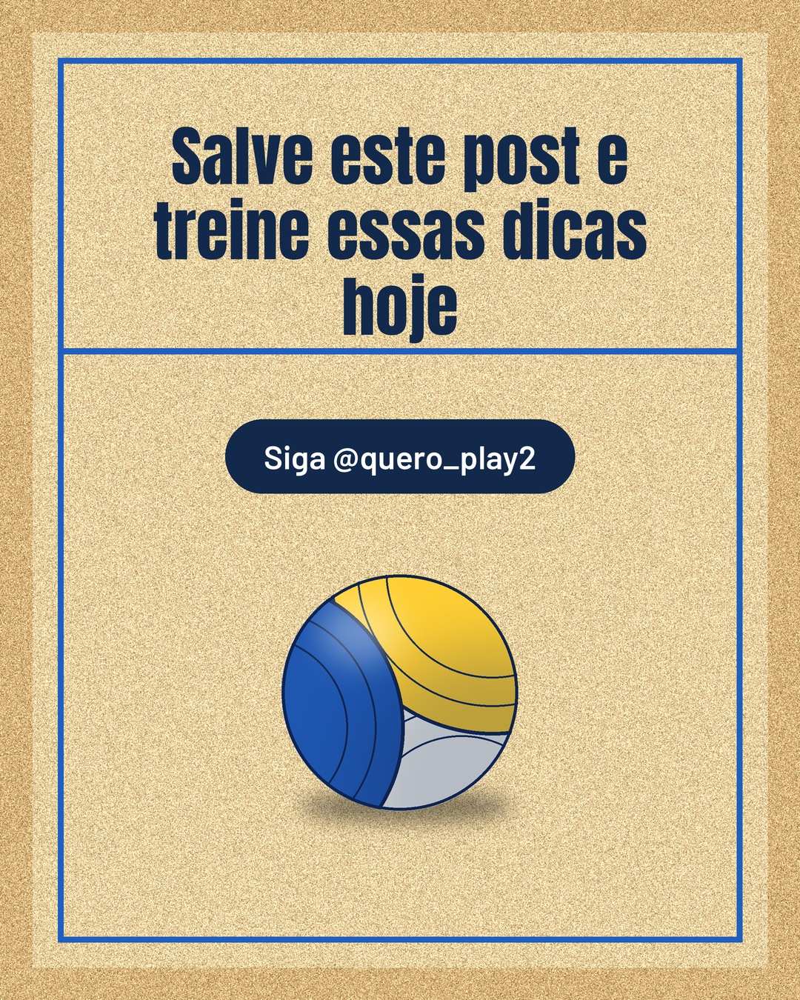

# areia

**Status:** ✅ publicado · [ver no Instagram](https://www.instagram.com/p/Dd2i6-zlrMu/) · 7 slides · gerado com `groq/openai/gpt-oss-120b`

      

## Legenda

> Quer melhorar no futebol e no vôlei sem complicações? 🏐⚽
>
> Cada slide traz um exercício ou ajuste que você pode aplicar agora mesmo. 🔥
>
> Deslize para o lado e descubra como evoluir seu desempenho. 👉
>
> Marque um amigo que precisa dessas dicas e siga para mais curiosidades esportivas! 📲
>
> 📷 Fotos: Renan Braz, RDNE Stock project, Pavel Danilyuk, Godson Babu e Arturo A (Pexels)
>
> #futebol #volei #dicasdefutebol #dicasdovolei #treinamento #esporte #curiosidades #performance #treinar #motivacao #aprendizado

---
**Quer mudar algo?** Edite o `legenda.txt` para trocar a legenda, ou o `post.json` para trocar os textos dos slides (depois rode `python main.py redesenhar 2026-09-28_162841`).
Foto não combinou? `python main.py trocar-foto 2026-09-28_162841 N` (0 = capa, 1, 2... = slides).
Para descartar este post, apague esta pasta.
