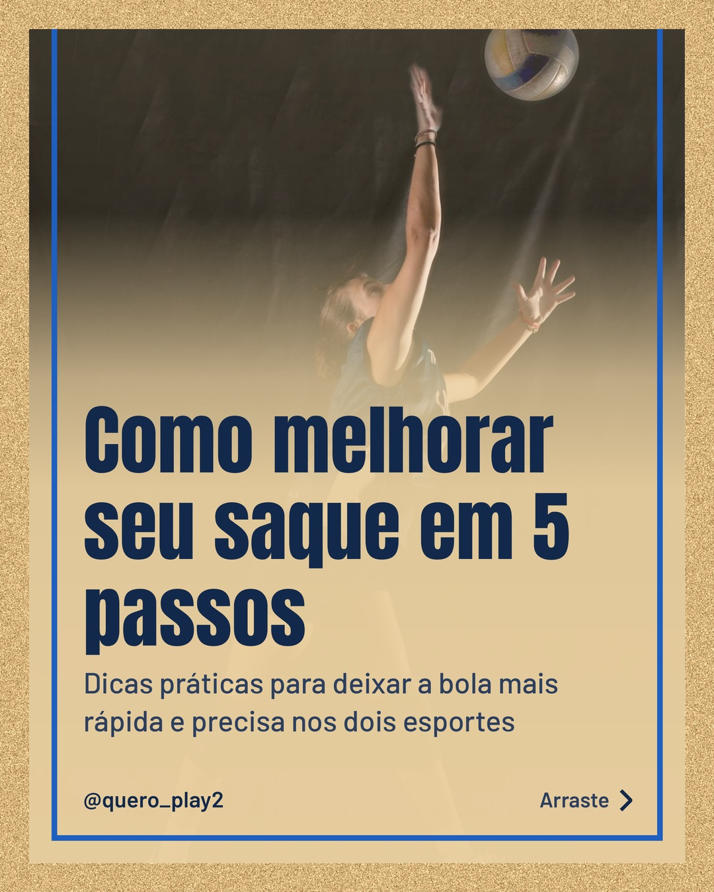
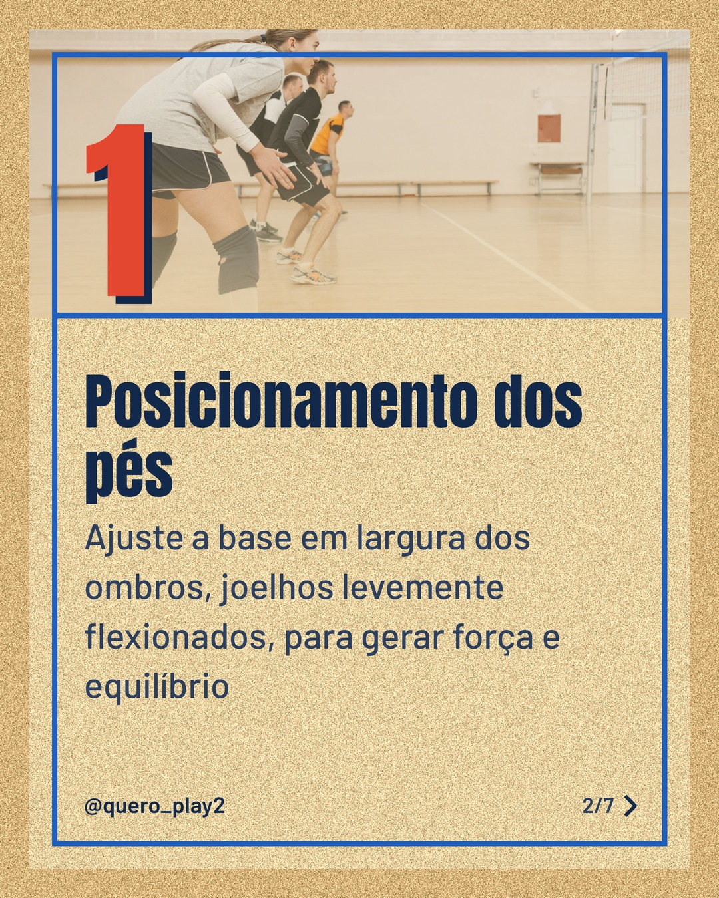
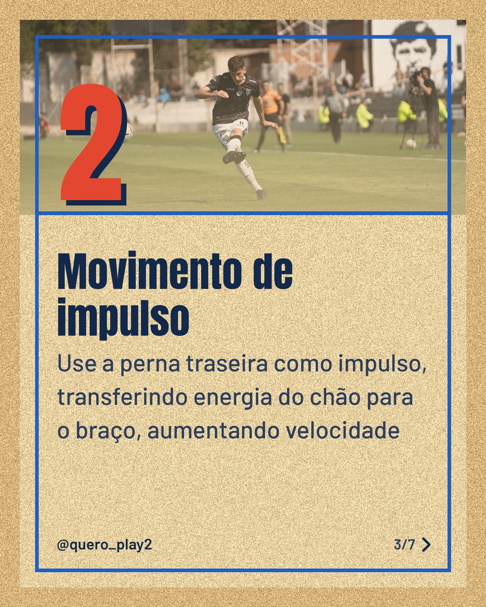
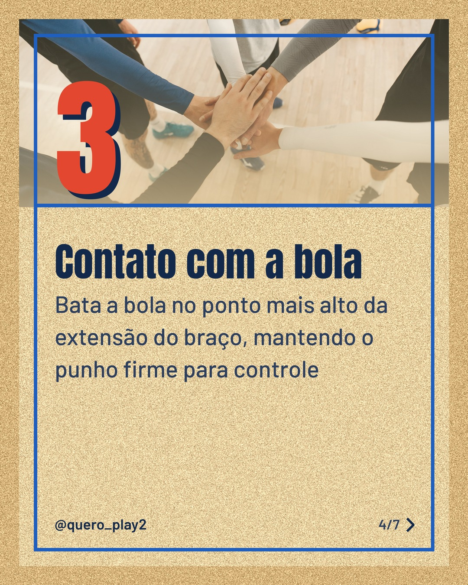
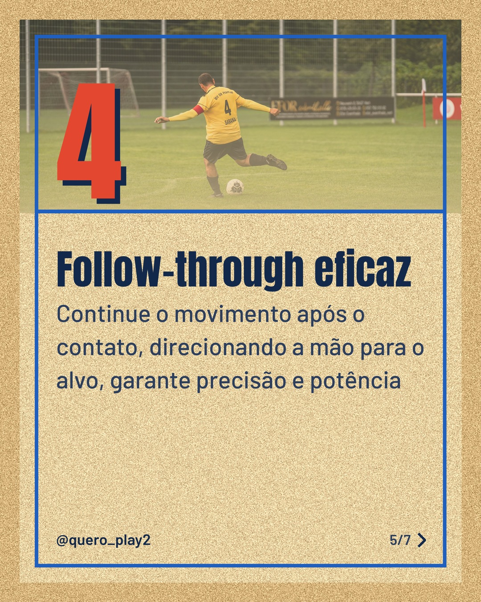
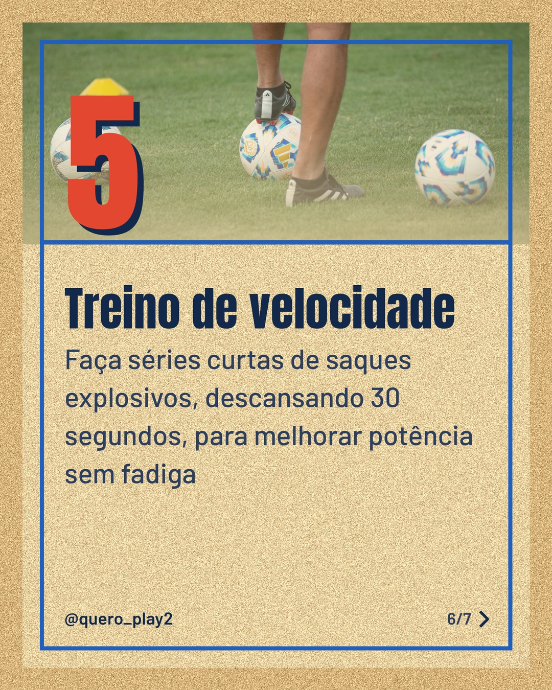
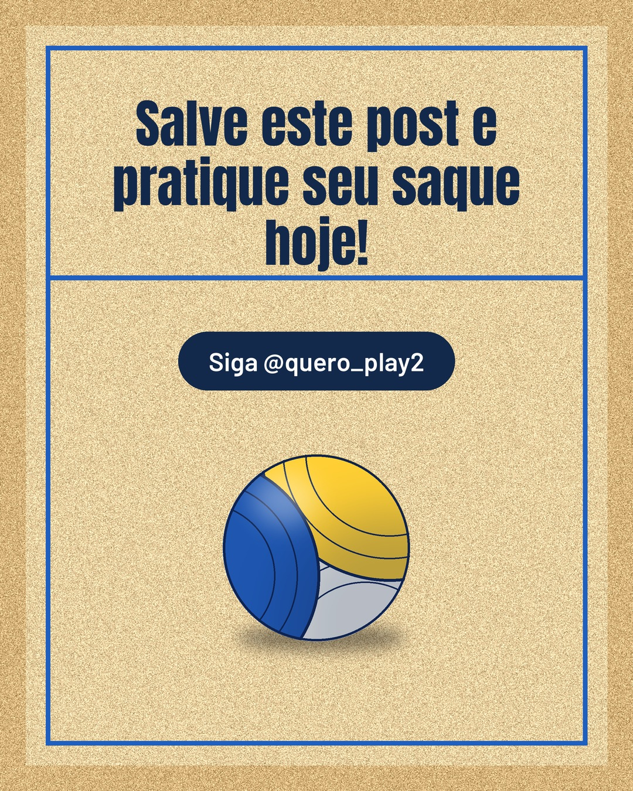

# areia

**Status:** ✅ publicado · [ver no Instagram](https://www.instagram.com/p/Dd6T9L5G2aF/) · 7 slides · gerado com `groq/openai/gpt-oss-120b`

      

## Legenda

> Quer melhorar seu saque no futebol ou no vôlei? ⚽🏐
> Deslize para o lado e descubra passos simples que vão transformar sua potência e precisão.
> Teste cada dica nos treinos e sinta a diferença na próxima partida.
> Marque um amigo que precisa dessas dicas e não esqueça de seguir para mais curiosidades esportivas! 🚀
>
> 📷 Fotos: maximiliano morgante, Pavel Danilyuk, Franco Monsalvo e Omar Ramadan (Pexels)
>
> #futebol #volei #saque #dicasdesportivas #treinamento #esportes #bola #técnica #treino #performance #esportesbrasil #curiosidades

---
**Quer mudar algo?** Edite o `legenda.txt` para trocar a legenda, ou o `post.json` para trocar os textos dos slides (depois rode `python main.py redesenhar 2026-09-28_220542`).
Foto não combinou? `python main.py trocar-foto 2026-09-28_220542 N` (0 = capa, 1, 2... = slides).
Para descartar este post, apague esta pasta.
