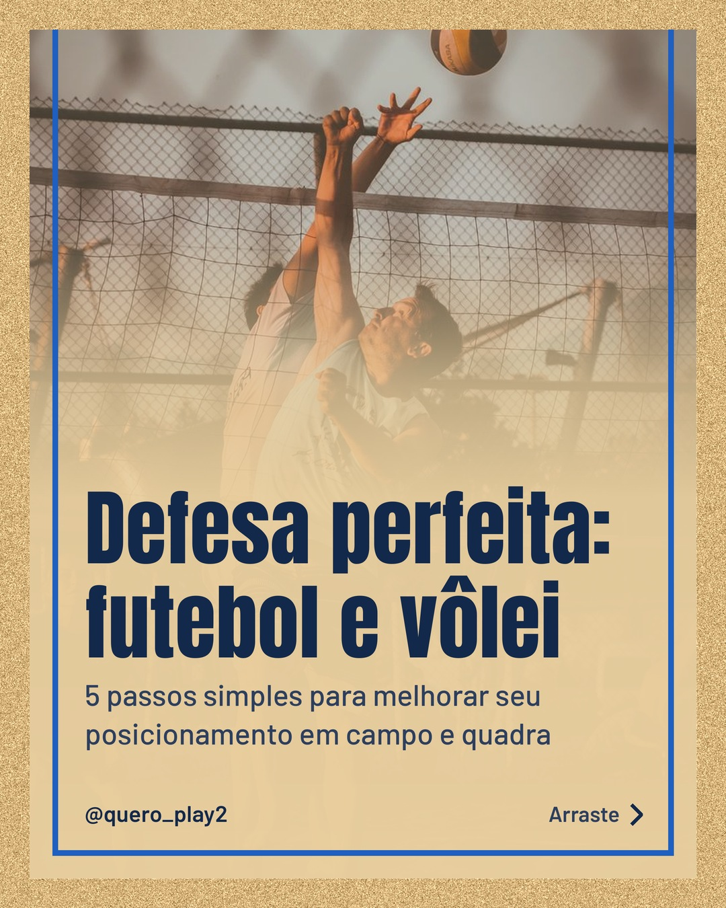
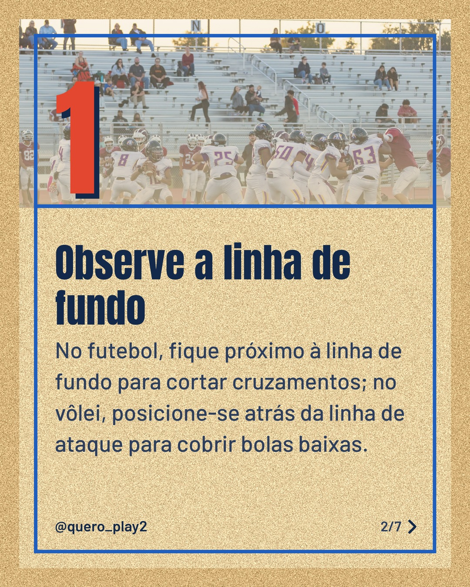
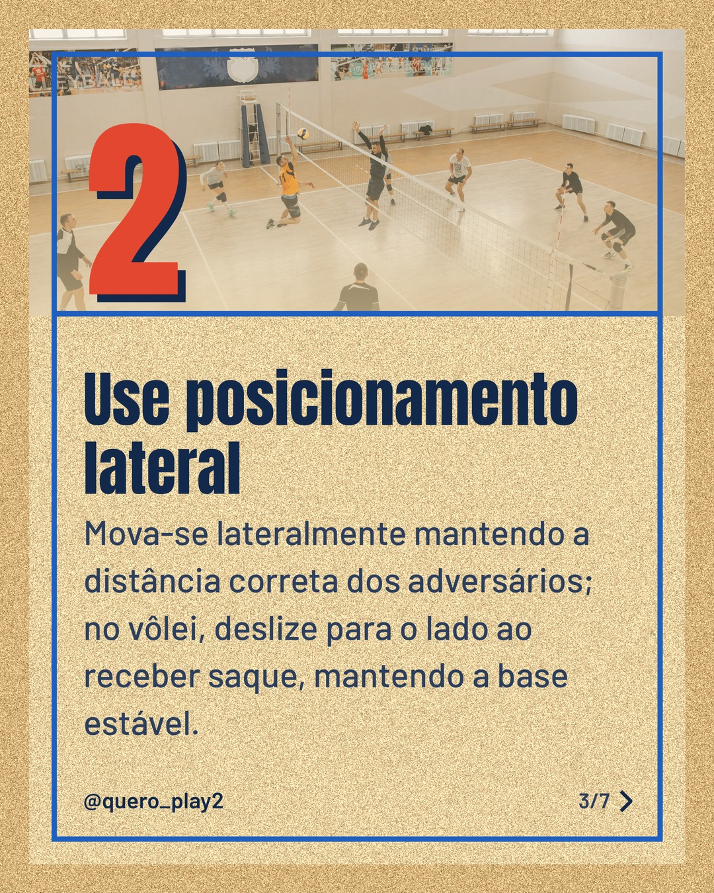
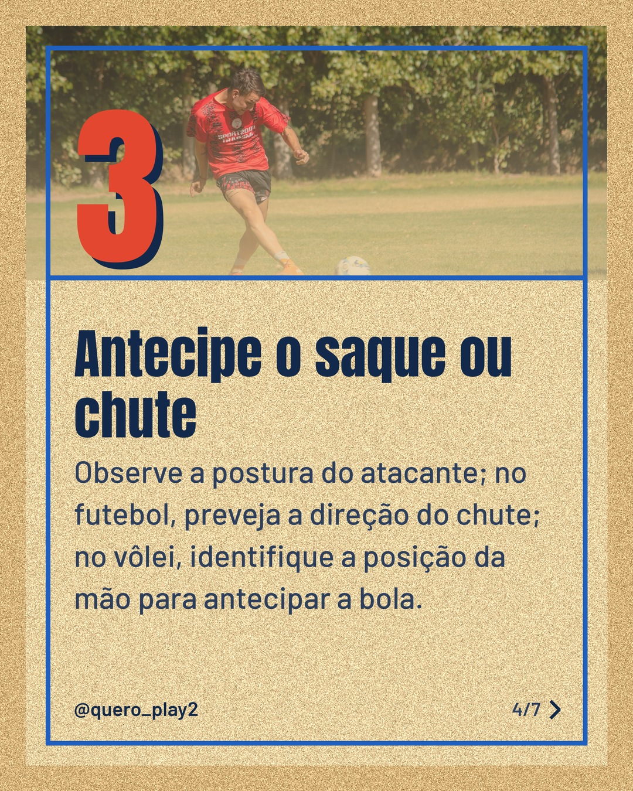
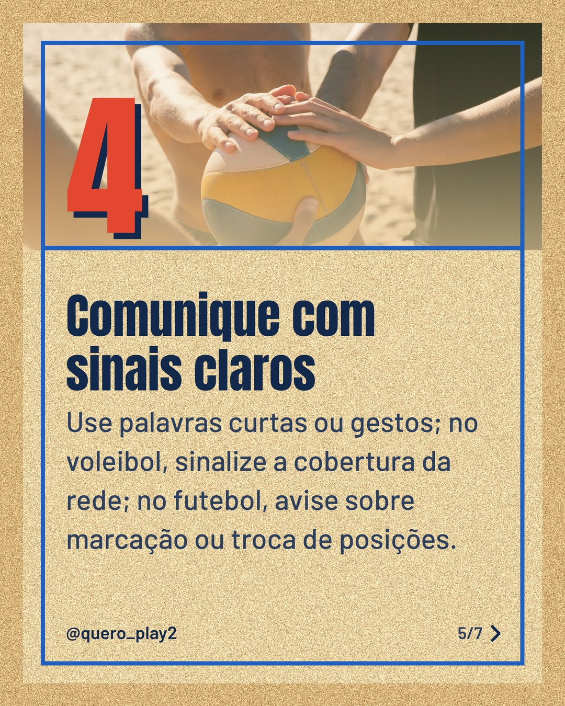
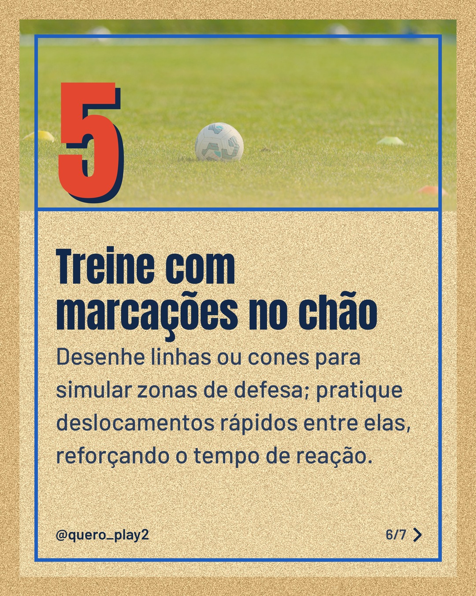
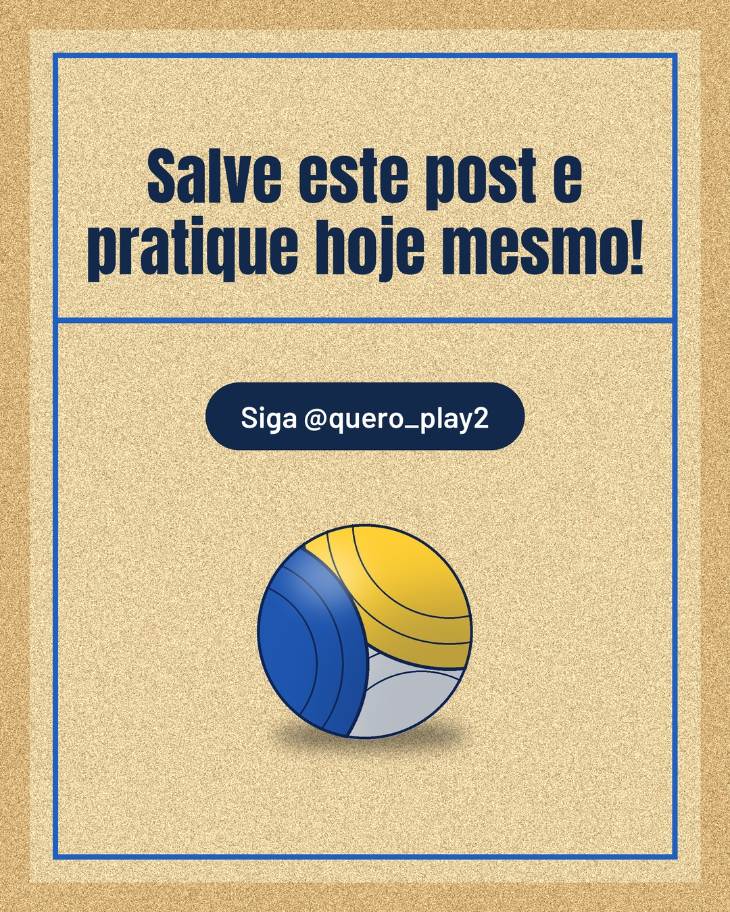

# areia

**Status:** ✅ publicado · [ver no Instagram](https://www.instagram.com/p/Dd7vttUgIBt/) · 7 slides · gerado com `groq/openai/gpt-oss-120b`

      

## Legenda

> Você sabia que pequenas mudanças no posicionamento podem transformar sua defesa tanto no futebol quanto no vôlei? 🏐⚽
>
> Confira cada dica nos slides, coloque em prática nos treinos e sinta a diferença na próxima partida. 💪
>
> Deslize para o lado, curta se ajudou e marque quem precisa melhorar a defesa! 🚀
>
> 📷 Fotos: veysel boz, Sean P. Twomey, Pavel Danilyuk, Franco Monsalvo, Kampus Production e Jay Brand (Pexels)
>
> #futebol #volei #defesa #posicionamento #treino #dicasdefensivas #esporte #jogadores #taticas #aprendizado

---
**Quer mudar algo?** Edite o `legenda.txt` para trocar a legenda, ou o `post.json` para trocar os textos dos slides (depois rode `python main.py redesenhar 2026-09-30_145048`).
Foto não combinou? `python main.py trocar-foto 2026-09-30_145048 N` (0 = capa, 1, 2... = slides).
Para descartar este post, apague esta pasta.
